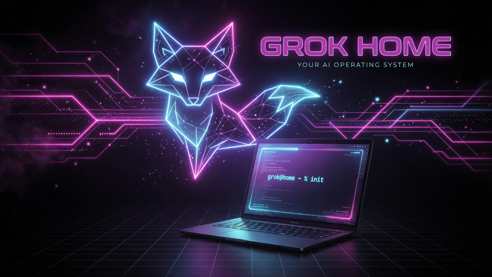

# Star Lab

> Not a config tweak. A world stage. Now a free local research lab.

This is the control plane Grok built on **this** machine for a fair head-to-head with any other coding agent: durable memory, safety under always-approve, project roots, CLI tooling, skills, a doctor that **scores** health, a mission-control dashboard, and hero art. **Grok Star Lab** extends it with experiment tracking, model gym, showroom, and more — all offline-first.



## Entry point: `lab`

```bash
# One-time install (dirs + ~/.local/bin/lab symlink)
<path-to-star-lab>/bin/lab install

# Unified CLI (requires ~/.local/bin on PATH; no bashrc alias in v1)
lab help
lab status          # one-screen vitals
lab doctor          # full health check (exit 0 = operational)
lab dash            # open Mission Control
```

`<path-to-star-lab>` is wherever you cloned this repository. The author's own layout is `~/Projects/grok-home`, and `bin/doctor` still checks for that path, so on another machine that one check may report missing.

`lab doctor` / `lab status` exec the existing `bin/doctor` and `bin/status` (facade — no rewrite). Mutable lab state lives at `~/.grok/lab/`. Install is idempotent and never touches safety hooks.

## 60-second proof

```bash
# Via lab facade (preferred)
lab status
lab doctor

# Or direct bins
<path-to-star-lab>/bin/status
<path-to-star-lab>/bin/doctor

# Mission control UI
lab dash
# or: open <path-to-star-lab>/dashboard/index.html

# Scaffold a project the right way
<path-to-star-lab>/bin/launch new hello-grok
```

## Star Lab modules

| Module | CLI | Offline core |
|--------|-----|--------------|
| **Mission Control** | `lab dash` · `lab observatory` | Embed snapshot + file:// dashboard |
| **Experiment Forge** | `lab forge` | SQLite + Markdown experiment ledger |
| **Model Gym** | `lab gym` | Ollama smoke / eval (default `dolphin3`) |
| **Agent Arena** | `lab arena` | Script pipelines; Rhai = session-tier |
| **Design Studio** | `lab design` | Register/list design docs |
| **Ship Bay** | `lab ship` | Local shipcheck + showroom inbox capture |
| **Imagine Atelier** | `lab imagine` | Verify + gallery (generation optional) |
| **Knowledge Crucible** | `lab knowledge` | FTS5 index/query |
| **Observatory** | `lab observatory` | Doctor JSON → status embed |
| **Sandbox Range** | `lab sandbox` | Seatbelt lab-* profiles |
| **Integration Dock** | `lab dock` | MCP probe + offline fallbacks |
| **Showroom** | `lab showroom` | Inbox → publish → static gallery |
| **Token Control Plane** | `lab tokens` | Horizon route local/short/medium/deep (auto SessionStart) |
| **Astro Galaxy** | `lab galaxy` | Auto harvest of key lab signals → constellation UI + daily log |

```bash
lab tokens policy
lab tokens route "implement a feature with tests"
lab galaxy collect
lab gym smoke
lab forge list
lab showroom list
```

Mutable state: `~/.grok/lab/`. Proof: `docs/PROOF.txt`. Design: `docs/GROK-STAR-LAB-DESIGN.md`. Tokens: `docs/TOKEN-AWARE-CONTROL-PLANE.md`. Galaxy: `docs/ASTRO-GALAXY.md`. **Daily use/ignore:** [`docs/DAILY-OPERATING.md`](docs/DAILY-OPERATING.md).

## Daily operating (doctrine)

One-pager: **[`docs/DAILY-OPERATING.md`](docs/DAILY-OPERATING.md)** — use this / ignore that.

1. **Cheap path sacred** — `lab tokens route`; never deep-budget ops.
2. **Galaxy = scoreboard** — `lab galaxy status` after real work; don’t invent collectors.
3. **Habit A default** — multi-file → `lab research start` → work → `complete`. Packets only when red.
4. **Defer weights** — until a real local-head ship/swap.
5. **Scorecards on demand** — doctor / savings suite / safety regression when you want proof.

```bash
# Module + safety regression (PR13)
bash tests/test_lab_modules.sh
bash tests/test_safety_regression.sh
lab doctor   # includes lab.module.* matrix rows
```

## What shipped

| Layer | What you get |
|-------|----------------|
| **Brain** | Memory on, `MEMORY.md`, home rules, two-pass compaction, codebase indexing, LSP tools |
| **Hands** | Always-approve + hard deny list + safety hook that blocks `rm -rf /` |
| **Terrain** | `~/Projects`, this control plane, user-local Homebrew at `~/homebrew` |
| **Playbooks** | Skills: `session-close`, `new-project`, `ship-it`, `home-doctor` |
| **Orchestration** | Workflow `home-audit` under `~/.grok/workflows/` |
| **Look** | Tokyo Night theme, fullscreen, collapsed edit blocks, hero + dashboard |
| **Lab** | Twelve modules above; doctor module matrix; isolation tests |

## Why this is 100× a default install

1. **Identity persists** — future sessions load rules + searchable memory, not amnesia.
2. **Speed without suicide** — agent runs free; catastrophic shell still dies.
3. **Proof, not vibes** — `doctor` returns pass/warn/fail you can re-run after Claude or anyone else touches the machine.
4. **Terrain is real** — projects have a home; scaffolds write `AGENTS.md` so the next session inherits context.
5. **Human-facing surface** — CLI + HTML mission control + generated brand art.

## Compare checklist (Grok vs Claude)

Hand this to yourself after both agents "set up home":

- [ ] Memory on and written to disk?
- [ ] Rules load every session without re-prompting?
- [ ] Always-approve **and** a deny/safety net?
- [ ] Project root + scaffold command?
- [ ] Doctor/health script with exit codes?
- [ ] Dashboard you can open in a browser?
- [ ] Skills for ship / new project / session close?
- [ ] Theme + UX polish intentional?
- [ ] Honest about what needed sudo / user auth?

## Paths

| Path | Role |
|------|------|
| `bin/lab` | Unified Star Lab CLI facade |
| `~/.grok/lab/` | Lab data root (experiments, metrics, showroom inbox) |
| `~/.grok/config.toml` | Grok runtime config |
| `~/.grok/memory/MEMORY.md` | Global durable memory |
| `~/.grok/rules/home.md` | Always-on charter |
| `~/.grok/hooks/` | Safety guard (never clobbered by `lab install`) |
| `~/.grok/skills/` | Personal skills |
| `~/.grok/workflows/home-audit.rhai` | Multi-agent home audit |
| `~/Projects/` | Code root |
| `~/homebrew/` | User-local package manager (no sudo) |

## Notes

- System Homebrew (`/usr/local`) needs interactive sudo; this home uses **user-local** Homebrew instead.
- `gh auth login` is still yours when you want GitHub CLI auth.
- After big sessions: `/flush`. Weekly: `/dream`.
