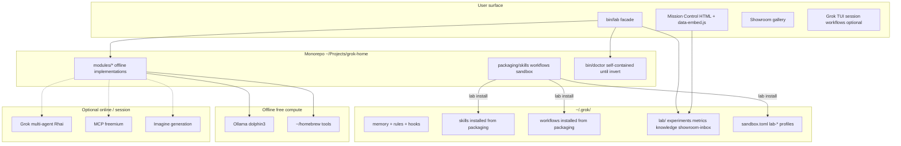
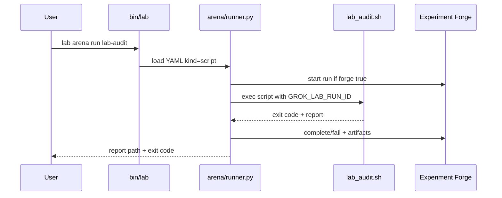
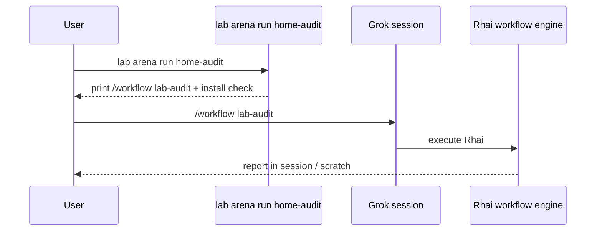
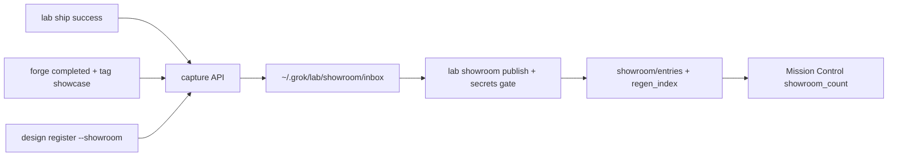
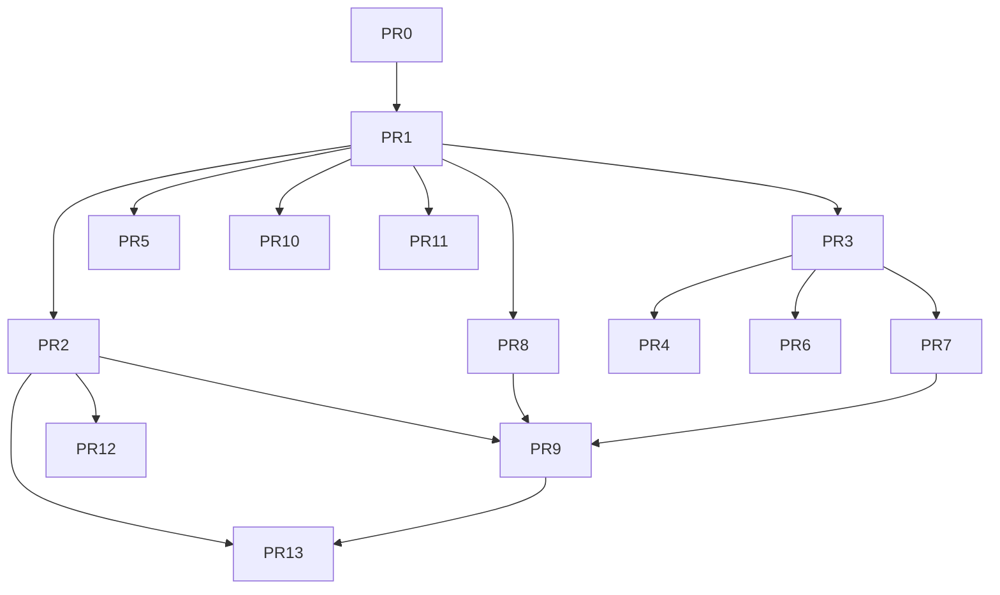

# Grok Star Lab — Free State-of-the-Art Local Laboratory

| Field | Value |
|-------|--------|
| **Document** | Grok Star Lab Design |
| **Author** | Grok Build (design-doc-writer) |
| **Date** | 2026-07-31 |
| **Status** | Ready for implementation (rev 3 — user decisions) |
| **Audience** | Senior engineers implementing on host `a100` (macOS) |
| **Supersedes** | Grok Home 100× control plane (extends, does not discard) |
| **Working name (rejected)** | Grok Star Laboratory |
| **Product name (chosen)** | **Grok Star Lab** |
| **Python baseline** | **3.9+** (host ships system `python3` 3.9.6; avoid 3.10+ syntax) |

---

## Overview

Grok Home (`~/Projects/grok-home`) already delivers a durable control plane: exit-coded `bin/doctor`, one-screen `bin/status`, `bin/launch`, a Tokyo Night mission-control HTML dashboard, personal skills (`session-close`, `new-project`, `ship-it`, `home-doctor`), a safety hook under always-approve, user-local Homebrew, Ollama (`dolphin3`), memory, home rules, and a `home-audit.rhai` workflow. That is a world stage — not a lab. Today `lib/`, `scripts/`, and `tests/` exist as empty stubs to fill; the repo is **not yet a git repository**.

**Grok Star Lab** is the next evolution: a free-to-run, local-first research/engineering laboratory that multiplies Grok Home into twelve interlocking modules — experiment tracking, model playground, multi-agent arena, design studio, ship bay, Imagine asset atelier, knowledge crucible, observability, sandboxes, optional MCP docks, and a permanent Showroom of best work.

**Honesty about free/offline:** Core lab success criteria bind to the **offline tier** only (doctor, forge, gym-vs-Ollama, knowledge FTS, showroom, dashboard embed, ship local checks, sandbox profile install, imagine *verify*). Multi-agent Rhai workflows, Imagine *generation*, MCP Dock probes, and remote Grok models are **optional online / Grok-session tiers** that degrade without failing core doctor. See [Offline vs online tier matrix](#offline-vs-online-tier-matrix).

The lab is implemented by **expanding the existing monorepo path** `~/Projects/grok-home` in place (product rebrand + `bin/lab` CLI facade first), not by forking into a parallel `grok-lab` tree. Mutable state lives at `~/.grok/lab/`. Runtime skills/workflows are **packaged in-repo** and installed into `~/.grok/` by `lab install`.

---

## Background & Motivation

### Current state (ground truth on this machine)

| Layer | Path / fact | Role today |
|-------|-------------|------------|
| Control plane | `~/Projects/grok-home` (~304K) | doctor / status / launch / static dashboard / hero |
| Empty stubs | `lib/`, `scripts/`, `tests/` | directories exist; fill in lab PRs |
| Git | **not a repository yet** | PR0 initializes |
| Runtime | `~/.grok/` (~164–166M incl. sessions) | config, memory, rules, hooks, skills, workflows, logs |
| Config | `~/.grok/config.toml` | always-approve, deny list, memory, LSP, indexing, two_pass_compaction, tokyonight, dashboard, telemetry=false |
| Memory | `~/.grok/memory/MEMORY.md` | durable home + preference notes |
| Rules | `~/.grok/rules/home.md` | Home Charter (always-on) |
| Safety | `~/.grok/hooks/safety-guard.json` + `scripts/safety_guard.py` | PreToolUse blocks catastrophic `rm`, mkfs, dd, fork bombs |
| Skills | `~/.grok/skills/{session-close,new-project,ship-it,home-doctor}/` | personal playbooks |
| Workflow | `~/.grok/workflows/home-audit.rhai` | parallel probes → synthesis (**in-session only**, not headless CLI) |
| Sandbox config | `~/.grok/sandbox.toml` | **missing today** — lab install creates |
| Tooling | `~/homebrew` + `~/.local/bin` | brew, rg, fd, fzf, gh, node v22, python3.9.6, jq |
| Models | Ollama `dolphin3:latest` (~4.9 GB) on `localhost:11434` | local inference present |
| Demo | `~/Projects/claude-compare-demo` | runnable HTML proof |
| Disk | ~1.6 TiB free on home volume | headroom for lab data |
| Sessions | `~/.grok/sessions/` (~7.5M early) | separate from lab knowledge index |
| Aliases | `~/.bashrc` | `ghstatus`, `ghdoctor`, `ghdash`; `$PROJECTS`; brew shellenv |
| Shims | `~/.local/bin/grok-doctor`, `grok-status`, `grok-home` | point at grok-home bins |

### Pain points

1. **Control plane ≠ lab.** doctor/status prove *setup health*, not *experiment quality*, *eval scores*, or *portfolio of best ships*.
2. **No experiment ledger.** Successful design loops, eval runs, and ships live only in chat history / session JSONL under `~/.grok/sessions/`.
3. **No local eval harness.** Ollama is installed but not wired into reproducible prompts, scoring, or regression sets.
4. **Agent orchestration is one-off.** Only `home-audit.rhai` exists; it is Grok-session-bound. Design loop, ship-it, and multi-agent reviews are not first-class lab pipelines with free offline artifacts.
5. **Dashboard is static.** `dashboard/index.html` hardcodes "on" states; it does not surface doctor scores or Showroom entries. `file://` cannot reliably `fetch()` local JSON.
6. **Show best work is manual.** `claude-compare-demo` and COMPARE docs are one-time proofs; no capture loop after ships.
7. **Knowledge is flat.** Global `MEMORY.md` + per-project `AGENTS.md` work, but no project-scoped search index or design-doc corpus (and must not collide with Grok `session_search.sqlite`).
8. **Sandbox is documented, not profiled for lab use.** No `sandbox.toml` yet; no curated lab profiles for untrusted code.

### Why free-to-run high-end

Professional AI labs often default to Weights & Biases, LangSmith, cloud vector DBs, Datadog, and hosted GPU playgrounds. Those remain optional later. On this Mac: **zero required paid SaaS for core offline operation**, user-local installs (no sudo), maximize Grok Build strengths when a session *is* available without making them hard dependencies.

---

## Goals & Non-Goals

### Goals

1. **Free offline core** — modules marked Offline-capable operate with OSS + local tools (brew/`~/.local`/Ollama/python3.9) with **no Grok platform auth and no network** required for their success criteria. See tier matrix.
2. **High-end feel** — experiment tracking, evals, agent pipelines (session-tier where needed), design docs, ship gate, asset verification, knowledge search, metrics, sandboxes, optional MCP, permanent portfolio.
3. **Grounded on this host** — extend real paths; preserve doctor exit codes and pass/warn/fail line stability through migration.
4. **Showcase always** — Showroom inbox auto-capture + explicit publish so best work is durable and curated.
5. **CLI-first + HTML Mission Control** — `lab` surface; default open path works under `file://` via **embed**, not `fetch`.
6. **Safety under always-approve** — keep deny list + safety hook; never weaken them; doctor fails closed on safety regressions.
7. **Incremental ship** — ordered PRs; doctor remains green after every merge; facade-first migration.

### Non-Goals

- Cloud GPU spend or hosted training clusters.
- Enterprise licenses as hard dependencies.
- Replacing Grok.com authentication or model backend for primary agent work.
- Multi-user multi-tenant lab.
- Kubernetes / Docker Desktop as required runtime.
- Replacing GitHub with a self-hosted forge.
- Perfect offline Imagine **generation** (verification + gallery are offline).
- Headless multi-agent Rhai without Grok runtime (not available as a free local daemon on this host).
- Integrating or replacing Grok’s `session_search.sqlite` in v1.

---

## Offline vs online tier matrix

| Module | Offline core (v1 success) | Optional online / session | Never required for doctor fail=0 |
|--------|---------------------------|---------------------------|----------------------------------|
| Mission Control | Embed snapshot + file:// open | `lab dash --live` HTTP | — |
| Experiment Forge | SQLite + Markdown | MLflow: document-only v1 (K18) | — |
| Model Gym | Ollama local eval suites (default `dolphin3`) | Remote Grok when authed (K20 best-work track) | Remote models (offline criteria) |
| Agent Arena | **Script pipelines** (`kind: script`) | **Rhai / multi-agent** (`kind: workflow`, Grok session) | Rhai success |
| Design Studio | Register/list local markdown paths | `/design` skill loop in session | — |
| Ship Bay | Local tests + commit notes | `gh pr create` | `gh auth` |
| Imagine Atelier | **verify** + gallery | **generation** via platform | generation |
| Knowledge Crucible | FTS5 index/query | Ollama embeddings (`nomic-embed-text` if enabled) | embeddings |
| Observatory | snapshot + doctor JSON | — | — |
| Sandbox Range | Install profiles + print use cmds | Live Seatbelt enforcement via `grok --sandbox` | Network isolation on macOS |
| Integration Dock | Offline fallbacks always | MCP probe when connected | MCP presence |
| Showroom | capture/publish/open static gallery | — | — |

**Success criteria (v1) bind only to Offline core columns.** Doctor module status for session-only features is `ok|warn|off`, never `fail` solely because Grok auth/MCP/Rhai is unavailable.

---

## Key Decisions

| # | Decision | Rationale |
|---|----------|-----------|
| K1 | **Product name: Grok Star Lab** | Fits CLI `lab`, UI “Star Lab”; working name retired. |
| K2 | **Expand `~/Projects/grok-home` in place** | Avoids splitting doctor/alias/MEMORY/COMPARE paths. Accept monorepo growth; compare-demo stays a sibling project under `~/Projects`, only *referenced* by Showroom. |
| K3 | **Data root: `~/.grok/lab/`** | Mutable lab state out of git; mirrors Grok’s `~/.grok` vs `~/Projects` split. |
| K4 | **`bin/lab` is a facade first**; existing `bin/doctor` / `bin/status` stay self-contained until a later invert | Prevents PR1 big-bang rewrite of the proven ~144-line doctor. See PR plan PR1/PR1b/PR2. |
| K5 | **Experiment store: SQLite + Markdown dual-write** | Zero daemon; WAL mode; single-writer v1. MLflow is document-only in v1 (K18) — not installed or packaged. |
| K6 | **Mission Control default data path = embed** | `lab dash` runs snapshot → writes `dashboard/data-embed.js` + `data/status.json` → opens `file://` HTML that reads inlined `window.GROK_LAB_STATUS`. `--live` is optional (127.0.0.1 only). Raw double-click without snapshot shows placeholders + missing-banner. |
| K7 | **Showroom auto-capture = inbox only** | `showroom_auto_capture=true` writes `~/.grok/lab/showroom/inbox/` on ship success; **never** auto-commits or auto-publishes. Publish is explicit (`lab showroom publish`). |
| K8 | **Knowledge: FTS5 default; embeddings optional** | No paid vector DB; no v1 integration with `session_search.sqlite`. |
| K9 | **Sandbox Range = curated Seatbelt profiles** | Install missing `[profiles.lab-*]` only; never clobber user profiles. |
| K10 | **MCP Dock optional; never doctor-fail** | Offline fallbacks always. |
| K11 | **Stack: bash + Python 3.9+ + static HTML/JS** | Match host; Node optional. |
| K12 | **Module layout `modules/<name>/` + `packaging/`** | Clear boundaries; runtime copies under `~/.grok` come from packaging. |
| K13 | **Canonical skills/workflows/sandbox fragments live in-repo under `packaging/`** | `lab install` copies with `skills_version` pin; PRs review source text; idempotent install. |
| K14 | **`data/status.json` gitignored; commit `data/status.example.json` only** | Real snapshots are machine-local; example documents schema. |
| K15 | **Offline Gym default model: `dolphin3:latest`** | Present on host; used when offline or when no remote auth. Override via `default_model` in `~/.grok/lab/config.toml`. |
| K16 | **Arena v1 offline path is `kind: script` only** | Bash/Python pipelines run under `lab arena run` with zero Grok session. `kind: workflow` is **session-tier only** (print `/workflow` instructions). No headless/`--try-headless` in v1 (K19). |
| K17 | **Doctor JSON is a versioned contract** | `lab doctor --json` (and eventually shared lib) emits `schema_version` + `checks[]`; Observatory consumes it — no duplicated probe logic long-term. |
| K18 | **MLflow is document-only in v1** | No `lab install --with-mlflow`, no daemon, no packaging hook. Future export/`pip install --user mlflow` may be documented in module README only. |
| K19 | **No headless workflow execution in v1** | Defer `--try-headless` / `grok -p` workflow launches to **v1.1**. Arena offline = script pipelines; Rhai stays in-session via `/workflow`. |
| K20 | **Gym dual model policy: remote when available** | For “best work” evals (`lab gym eval` with best-work / non-smoke intent, or `--track best`): prefer remote Grok model when authenticated; fall back to `dolphin3:latest` offline or unauthenticated. Offline success criteria and smoke suite still use dolphin3 (K15). |
| K21 | **Optional embeddings default model: `nomic-embed-text`** | When `use_embeddings=true` and user pulls an embed model, default is `nomic-embed-text` via Ollama. Embeddings remain off by default (K8). |
| K22 | **Canonical design doc path** | Durable copy lives at `~/Projects/grok-home/docs/GROK-STAR-LAB-DESIGN.md` (not `STAR-LAB.md`). |

---

## Proposed Design

### System architecture



### Target directory tree

```text
~/Projects/grok-home/                    # Grok Star Lab monorepo (path unchanged)
├── AGENTS.md
├── README.md
├── bin/
│   ├── lab                              # unified CLI dispatcher (facade)
│   ├── doctor                           # KEEP self-contained until invert PR
│   ├── status                           # KEEP self-contained until invert PR
│   └── launch                           # extended; dashboard → lab dash
├── dashboard/
│   ├── index.html                       # Mission Control (reads window.GROK_LAB_STATUS)
│   ├── data-embed.js                    # GENERATED by lab dash/snapshot (gitignored)
│   ├── modules.html
│   └── app.js                           # progressive enhancement
├── data/
│   ├── status.example.json              # COMMITTED schema sample
│   └── status.json                      # GENERATED, gitignored
├── packaging/                           # CANONICAL sources for ~/.grok install
│   ├── skills/
│   │   ├── lab-ship/SKILL.md
│   │   ├── lab-showcase/SKILL.md
│   │   ├── design-register/SKILL.md
│   │   └── ship-it/SKILL.md             # patched ship-it text (overlay)
│   ├── workflows/
│   │   ├── lab-audit.rhai               # session-tier multi-agent (optional)
│   │   └── ship-pipeline.rhai           # optional
│   └── VERSION                          # skills_version pin source
├── modules/
│   ├── forge/
│   │   ├── cli.py                       # lab forge …
│   │   ├── forge.py                     # library + run wrapper
│   │   ├── schema.sql
│   │   └── migrations/
│   ├── gym/
│   │   ├── cli.py
│   │   ├── harness.py
│   │   └── suites/smoke.jsonl
│   ├── arena/
│   │   ├── cli.py
│   │   ├── runner.py                    # dispatches kind:script | kind:workflow
│   │   └── pipelines/
│   │       ├── lab-audit.yaml           # kind: script → modules/arena/scripts/lab_audit.sh
│   │       ├── home-audit.yaml          # kind: workflow → session instructions
│   │       └── …
│   │   └── scripts/
│   │       └── lab_audit.sh             # FREE offline multi-check audit
│   ├── design/
│   │   └── cli.py
│   ├── ship/
│   │   ├── cli.py
│   │   └── shipcheck.sh
│   ├── imagine/
│   │   └── cli.py                       # verify + gallery only offline
│   ├── knowledge/
│   │   ├── cli.py
│   │   ├── index.py
│   │   └── query.py
│   ├── observatory/
│   │   └── cli.py                       # snapshot, status-screen, report, tail
│   ├── sandbox/
│   │   ├── cli.py
│   │   └── profiles.fragment.toml
│   ├── dock/
│   │   └── cli.py
│   └── showroom/
│       ├── cli.py
│       ├── capture.py
│       └── regen_index.py
├── showroom/
│   ├── index.html                       # regenerated by publish
│   └── entries/<id>/{meta.json,body.md}
├── docs/
│   ├── COMPARE-WITH-CLAUDE.md
│   ├── PROOF.txt
│   ├── GROK-STAR-LAB-DESIGN.md          # this design (canonical)
│   └── modules/
├── lib/
│   ├── common.sh                        # PATH (homebrew, .grok/bin, .local/bin), colors
│   ├── checks.sh                        # shared doctor check primitives (extracted PR2)
│   ├── doctor_json.py                   # emit/consume doctor JSON schema
│   └── lab_paths.py
├── scripts/
│   ├── install-lab.sh
│   └── migrate-from-home-100x.sh
├── tests/
│   ├── test_doctor_compat.sh            # exit code + pass/warn/fail format stable
│   ├── test_lab_cli.sh
│   ├── test_forge.py
│   ├── test_safety_regression.sh
│   ├── test_install_idempotent.sh
│   └── fixtures/
├── assets/
│   └── hero.jpg
└── .gitignore                           # data/status.json, dashboard/data-embed.js, caches

~/.grok/lab/
├── config.toml
├── experiments.db                       # SQLite WAL
├── experiments/<exp_id>/{meta.md,results.json}
├── metrics/daily/YYYY-MM-DD.json
├── metrics/lab.log                      # single-writer; rotate at 5MB
├── knowledge/{fts.db,embeddings/}
├── showroom/inbox/<capture_id>.json
├── imagine/runs/
└── gym/results/

~/.grok/skills/…                         # installed FROM packaging/skills
~/.grok/workflows/…                      # installed FROM packaging/workflows
~/.grok/sandbox.toml                     # lab-* profiles merged in
```

### CLI surface (authoritative)

```text
lab help
lab install [--dry-run]              # dirs, packaging install, aliases, symlinks
lab doctor [--json] [--fix]         # --fix: closed allowlist only (see below)
lab status                           # human one-screen vitals (may call snapshot)
lab dash [--live]                    # snapshot + embed + open file://  |  --live HTTP
lab observatory snapshot|report|tail

lab forge init|run|list|show|export
lab gym list|pull|eval|chat
lab arena list|run|describe          # offline scripts + session workflow handoff
lab design list|open|register
lab ship check|run|pr
lab imagine verify|gallery
lab knowledge index|query|status
lab sandbox list|use|test
lab dock status|probe
lab showroom list|add|capture|publish|open
```

**`lab doctor --fix` (closed set — v1):**

Allowed fixes only:

1. Create missing `~/.grok/lab/**` directories (mode 0700).
2. Re-copy packaging skills/workflows when version pin mismatches (never delete user-only skills).
3. Ensure `~/.local/bin/lab` symlink points at repo `bin/lab`.
4. Write missing `data/status.example.json` if deleted from worktree.

**Never** via `--fix`: edit deny rules, overwrite hooks content, `git` mutations, delete files, change `permission_mode`, merge destructive sandbox overwrites.

If a finding is outside the allowlist, print manual steps and exit non-zero for that class of issues without inventing repairs.

### CLI dispatch layout (frozen — no phantom bins)

| Subcommand | Implementation |
|------------|----------------|
| `lab` | `bin/lab` bash dispatcher; sources `lib/common.sh`; `case` → module |
| `lab doctor` | **PR1–PR1b:** `exec "$ROOT/bin/doctor" "$@"` (facade). **After invert PR:** doctor logic stays in `bin/doctor` or shared `lib/checks.sh` called by both; **never** invent `bin/lab-doctor`. |
| `lab status` | **PR1:** `exec "$ROOT/bin/status"`. **Later:** `modules/observatory/cli.py status-screen` which may invoke snapshot first. |
| `lab dash` | `modules/observatory/cli.py dash` → snapshot + write embed + `open` |
| `lab observatory *` | `modules/observatory/cli.py` |
| `lab forge *` | `python3 modules/forge/cli.py` |
| `lab gym *` | `python3 modules/gym/cli.py` |
| `lab arena *` | `python3 modules/arena/cli.py` |
| `lab design *` | `python3 modules/design/cli.py` |
| `lab ship *` | `modules/ship/cli.py` or bash → `shipcheck.sh` |
| `lab imagine *` | `python3 modules/imagine/cli.py` |
| `lab knowledge *` | `python3 modules/knowledge/cli.py` |
| `lab sandbox *` | `python3 modules/sandbox/cli.py` |
| `lab dock *` | `python3 modules/dock/cli.py` |
| `lab showroom *` | `python3 modules/showroom/cli.py` |
| `lab install` | `scripts/install-lab.sh` |

**`lab status` vs `lab observatory snapshot`:**

| Command | Audience | Output |
|---------|----------|--------|
| `lab status` | Human terminal | Compact vitals (home-style + lab module one-liners). May call snapshot under the hood. |
| `lab observatory snapshot` | Machines / dash | Writes `data/status.json` + `dashboard/data-embed.js` + daily metrics. Exit 0 if write succeeded. |
| `lab doctor` | Health gate | Full pass/warn/fail scorer; exit 1 if fail&gt;0. |
| `lab doctor --json` | Observatory / tools | Versioned JSON object (see schema); still exit 1 if fail&gt;0. |

### Path resolution (`lib/lab_paths.py`)

```python
# Python 3.9+ compatible
from pathlib import Path
import os

HOME = Path.home()
LAB_REPO = Path(os.environ.get("GROK_LAB_REPO", str(HOME / "Projects" / "grok-home")))
GROK_HOME = Path(os.environ.get("GROK_HOME", str(HOME / ".grok")))
LAB_DATA = Path(os.environ.get("GROK_LAB_DATA", str(GROK_HOME / "lab")))
PROJECTS = Path(os.environ.get("PROJECTS", str(HOME / "Projects")))

EXPERIMENTS_DB = LAB_DATA / "experiments.db"
FTS_DB = LAB_DATA / "knowledge" / "fts.db"
STATUS_JSON = LAB_REPO / "data" / "status.json"
STATUS_EXAMPLE = LAB_REPO / "data" / "status.example.json"
DATA_EMBED_JS = LAB_REPO / "dashboard" / "data-embed.js"
SHOWROOM_DIR = LAB_REPO / "showroom"
PACKAGING = LAB_REPO / "packaging"
```

### `lib/common.sh` PATH contract

Must match existing doctor preamble:

```bash
[[ -x "$HOME/homebrew/bin/brew" ]] && eval "$("$HOME/homebrew/bin/brew" shellenv)" 2>/dev/null || true
export PATH="$HOME/.grok/bin:$HOME/.local/bin:$HOME/homebrew/bin:/usr/local/bin:$PATH"
```

---

### Module specifications

---

#### 1. Mission Control

| | |
|--|--|
| **Purpose** | Human-facing map of lab health, modules, recent experiments, Showroom highlights. |
| **Local stack** | Static HTML/CSS/JS (Tokyo Night). **No fetch of local JSON on file://.** |
| **Layout** | `dashboard/index.html`, `dashboard/data-embed.js` (generated), `dashboard/app.js` |
| **Interfaces** | `lab dash`, `lab dash --live` |
| **Replaces** | Personal Retool/Notion ops boards |

**Default open path (normative):**

1. `lab dash` always runs `lab observatory snapshot` (or in-process equivalent).
2. Snapshot writes:
   - `data/status.json` (gitignored)
   - `dashboard/data-embed.js` containing:
     ```js
     // generated — do not edit
     window.GROK_LAB_STATUS = { ...status object... };
     ```
3. `open "$ROOT/dashboard/index.html"` (file://). HTML loads `<script src="data-embed.js"></script>` then `app.js` reads `window.GROK_LAB_STATUS`.
4. If `data-embed.js` missing or `generated_at` absent: UI shows **amber banner** “Run `lab dash` or `lab observatory snapshot`” and placeholder tiles (not fake green “on”).

**`--live` path:** `python3 -m http.server` bound to **`127.0.0.1`**, try ports **8765–8775** until one binds; print URL; open that URL. On collision exhaustion, exit 1 with message. Serves repo root so `/data/status.json` is fetchable.

**status.json / embed schema (v1):**

```json
{
  "schema_version": 1,
  "generated_at": "ISO-8601",
  "host": "hostname",
  "doctor": {
    "pass": 0, "warn": 0, "fail": 0,
    "operational": true,
    "checks": []
  },
  "modules": {
    "forge": "ok|warn|off",
    "gym": "ok|warn|off",
    "arena": "ok|warn|off",
    "design": "ok|warn|off",
    "ship": "ok|warn|off",
    "imagine": "ok|warn|off",
    "knowledge": "ok|warn|off",
    "observatory": "ok|warn|off",
    "sandbox": "ok|warn|off",
    "dock": "ok|warn|off",
    "showroom": "ok|warn|off"
  },
  "ollama_models": ["dolphin3:latest"],
  "recent_experiments": [],
  "showroom_count": 0,
  "showroom_inbox_count": 0,
  "disk_free_home": "1.6Ti",
  "safety": {"hook": true, "deny_rules": true},
  "lab_skills_version": "0.0.0"
}
```

**Built-in Grok `/dashboard`:** remains the **agent session** control surface (TUI). Star Lab Mission Control is the **proof/COMPARE** human HTML surface. They complement; neither replaces the other (see Alternatives E).

---

#### 2. Experiment Forge

| | |
|--|--|
| **Purpose** | Local experiment tracking: params, metrics, artifacts, git SHA, session id. |
| **Local stack** | SQLite 3 WAL + Markdown dual-write; stdlib `sqlite3`. |
| **Layout** | `modules/forge/` |
| **Interfaces** | `lab forge init\|run\|list\|show\|export` |
| **Replaces** | W&B / Neptune core tracking |

**schema.sql essentials:**

```sql
PRAGMA journal_mode=WAL;
PRAGMA user_version=1;

CREATE TABLE experiments (
  id TEXT PRIMARY KEY,
  name TEXT NOT NULL,
  project TEXT,
  git_sha TEXT,
  session_id TEXT,
  status TEXT CHECK(status IN ('running','completed','failed','aborted')),
  created_at TEXT NOT NULL,
  finished_at TEXT,
  tags TEXT,
  exit_code INTEGER
);
-- metrics, params, artifacts as previously specified
```

**Single-writer assumption (v1):** CLI is the only writer; no concurrent forge daemons. WAL still enabled for crash resilience and future readers.

##### `lab forge run` contract (normative)

```bash
lab forge run --name NAME [--project P] [--tag TAG ...] -- CMD [ARGS...]
```

**Behavior:**

1. Create experiment row `status=running`, generate `id` (ulid/uuid hex).
2. Export environment for child:
   - `GROK_LAB_RUN_ID=<id>`
   - `GROK_LAB_DATA=<path>`
   - `GROK_LAB_REPO=<path>`
3. Run `CMD` in current working directory (caller’s cwd); no shell unless CMD is explicitly `bash -c …`.
4. Stream child stdout/stderr to terminal; also tee to `~/.grok/lab/experiments/<id>/console.log`.
5. On child exit:
   - exit 0 → `status=completed`
   - non-zero → `status=failed`
   - signal/timeout → `status=aborted` (optional `--timeout SECS`; default no timeout in v1)
6. Always set `finished_at` and `exit_code`.
7. **Markdown dual-write only on terminal states** (`completed|failed|aborted`): write `meta.md` + `results.json` via temp file + atomic rename.
8. Forge process exit code = child exit code (so CI gates work).

**Child metric API:**

```python
# modules/forge/forge.py
import os
from forge import Forge  # same package

run_id = os.environ["GROK_LAB_RUN_ID"]  # required inside forge run
Forge(run_id).log_metric("pass_rate", 1.0, step=0)
Forge(run_id).log_param("model", "dolphin3:latest")
Forge(run_id).log_artifact(path, kind="results")
```

**Bash-only child:**

```bash
# append one metric line for simple scripts (parsed by forge on completion optional v1.1)
# v1: prefer Python helper or:
python3 -c "from pathlib import Path; import os,sys; sys.path.insert(0,'$GROK_LAB_REPO/modules/forge'); from forge import Forge; Forge(os.environ['GROK_LAB_RUN_ID']).log_metric('ok',1)"
```

**Showcase tag hook:** When terminal status is `completed` and tags contain `showcase`, call `showroom.capture_api(...)` (same code path as `lab showroom capture --from-forge <id>`). Writes **inbox only**.

**Example:**

```bash
lab forge run --name gym-smoke-dolphin3 --project grok-home --tag gym -- \
  lab gym eval smoke
```

---

#### 3. Model Gym

| | |
|--|--|
| **Purpose** | Local playground + eval harness against Ollama. |
| **Local stack** | Ollama HTTP `localhost:11434`; JSONL suites; Python 3.9 harness. |
| **Default model (offline)** | `dolphin3:latest` (K15) |
| **Best-work model (online)** | Prefer remote Grok when authenticated (K20); fall back to dolphin3 |
| **Interfaces** | `lab gym list\|pull\|eval\|chat` |
| **Replaces** | Basic hosted eval UIs |

**Model selection policy (normative):**

| Mode | Trigger | Model |
|------|---------|--------|
| Offline / smoke | No network, no Grok auth, or `lab gym eval smoke`, or success-criteria runs | `default_model` = `dolphin3:latest` |
| Best-work | `lab gym eval <suite> --track best` (or suite metadata `track: best`) **and** Grok remote available/authenticated | Prefer remote Grok (e.g. session default / `best_work_model` config); on failure or unauth → dolphin3 with logged `model_fallback=true` |
| Explicit | `--model <name>` | Always wins |

Config keys:

```toml
default_model = "dolphin3:latest"           # offline + smoke
best_work_model = "grok-4.5"                # preferred when authed; adjust to available remote id
prefer_remote_when_available = true         # K20
```

**Suite format** (`suites/smoke.jsonl`):

```json
{"id":"s1","prompt":"Reply with exactly: pong","expect_contains":"pong","max_tokens":32}
{"id":"s2","prompt":"What is 2+2? Answer with one digit.","expect_regex":"4","max_tokens":8}
```

If `GROK_LAB_RUN_ID` is set, log `pass_rate`, `n_pass`, `n_total`, and `model` to Forge. Offline success criteria never require remote Grok.

---

#### 4. Agent Arena

| | |
|--|--|
| **Purpose** | Catalog and run lab pipelines; offline scripts first; Grok multi-agent when in session. |
| **Local stack** | YAML registry + bash/python runners; optional Rhai sources in `packaging/workflows` for session use. |
| **Interfaces** | `lab arena list\|run\|describe` |
| **Replaces** | Hosted multi-agent UIs for personal scale |

##### Pipeline kinds (normative)

```yaml
# modules/arena/pipelines/lab-audit.yaml
name: lab-audit
kind: script                    # OFFLINE
description: Module presence, safety, disk, ollama — pure local
script: modules/arena/scripts/lab_audit.sh
forge: true
timeout_secs: 120
```

```yaml
# modules/arena/pipelines/home-audit.yaml
name: home-audit
kind: workflow                  # GROK SESSION TIER
description: Multi-agent Rhai probes (requires Grok session)
workflow_src: packaging/workflows/lab-audit.rhai   # or home-audit.rhai
workflow_install_name: lab-audit   # installed name under ~/.grok/workflows/
forge: false                    # optional; session may log manually
```

##### Invocation matrix (v1)

| Pipeline kind | `lab arena run` behavior | Offline? | Auth |
|---------------|--------------------------|----------|------|
| `script` | Execute `script` relative to repo root with `lib/common.sh` PATH; env `GROK_LAB_*`; optional wrap in `lab forge run` if `forge: true` | **Yes** | None |
| `workflow` | **Session-tier only (v1).** Print: (1) ensure installed via `lab install`; (2) exact user action: start Grok in repo and run `/workflow <workflow_install_name>` or ask agent to launch named workflow; (3) optional `--handoff-prompt` writes a fixed prompt file the user can paste. Exit 0 after printing if install present; exit 2 if workflow file missing. **No headless execution in v1 (K19).** | **No** (multi-agent) | Grok session |

**There is no free local Rhai daemon.** Multi-agent Rhai is a Grok-runtime feature. `validate_only` is an **in-session** `workflow` tool parameter for authors; lab CLI does **not** expose `validate_only`. **`--try-headless` is deferred to v1.1** — do not implement or document as a v1 flag.

##### Offline `lab_audit.sh` (script pipeline) responsibilities

1. Check module directories exist under `modules/`.
2. Invoke safety_guard allow/deny smoke (same as doctor).
3. Disk free warning threshold.
4. `ollama list` best-effort.
5. Packaging version pin present.
6. Write report JSON under `~/.grok/lab/metrics/` and stdout summary; exit 1 on hard failures (missing safety hook, missing lab data root).

##### Sequence — offline `lab arena run lab-audit`



##### Session-tier handoff (workflow)



---

#### 5. Design Studio

| | |
|--|--|
| **Purpose** | Registry of design docs; paths under projects. |
| **Local stack** | Markdown + catalog tables in lab DB. |
| **Interfaces** | `lab design list\|open\|register` |
| **Canonical path** | `~/Projects/<project>/docs/design/<YYYY-MM-DD>-<slug>.md` |

`lab design register <path> [--project] [--slug] [--showroom]` copies/records pointer; `--showroom` → capture API inbox only.

Skill source: `packaging/skills/design-register/SKILL.md` → installed by `lab install`.

---

#### 6. Ship Bay

| | |
|--|--|
| **Purpose** | Review → test → commit notes → optional PR; feed Showroom inbox. |
| **Local stack** | git, gh (optional), `shipcheck.sh` |
| **Interfaces** | `lab ship check\|run\|pr` |

**shipcheck.sh:**

1. git status / warn if main.
2. Detect tests from AGENTS.md / package.json / pytest.
3. Run tests; capture exit.
4. Diffstat + risk notes.
5. On full success **and** capture not disabled: call capture API → inbox.

**Skip auto-capture when any of:**

- `--no-capture` flag
- `showroom_auto_capture=false` in lab config
- shipcheck failed / partial
- branch name matches `wip/*` or `tmp/*` (configurable)
- secrets scan on diff hits patterns (`API_KEY=`, `BEGIN PRIVATE KEY`, `.env` path content) → warn and skip capture
- user env `GROK_LAB_NO_CAPTURE=1`

**PR8 stub:** `modules/showroom/capture.py` exposes `capture_ship(...)` no-op or inbox write stub; PR9 completes publish/regen. ship-it skill text lands via packaging overlay.

**Exact ship-it skill addition** (`packaging/skills/ship-it/SKILL.md` overlay step):

```markdown
7. On successful ship (tests green, commit or PR prepared as requested):
   - If `lab` is on PATH, run:
     `lab showroom capture --from-ship --project <name> --title "<short>"`
     (writes inbox only; does not publish or git-add).
   - If capture skips due to secrets/WIP rules, tell the user why.
   - Then suggest `/flush` as today.
```

---

#### 7. Imagine Atelier

| | |
|--|--|
| **Purpose** | Local **verification** + gallery; generation is optional online. |
| **Offline** | `lab imagine verify <path>`, `lab imagine gallery` |
| **Online** | Session Imagine tools for generation |

**verify.py:** non-empty file, MIME, optional `sips` dimensions; refuse paths matching `**/.env`, `**/*.pem`, credential globs. Write verification JSON under `~/.grok/lab/imagine/runs/`.

Doctor: missing generation capability → never fail; verify tooling missing `sips` → warn only.

---

#### 8. Knowledge Crucible

| | |
|--|--|
| **Purpose** | Local search over lab-relevant markdown. |
| **Default** | SQLite FTS5 + rg |
| **Optional embeddings** | Off by default; if enabled, Ollama model **`nomic-embed-text`** (K21) |
| **Not in v1** | Grok `session_search.sqlite` integration (separate index; different purpose) |

**Default sources:**

| Source | Pattern |
|--------|---------|
| Memory | `~/.grok/memory/**/*.md` |
| Rules | `~/.grok/rules/**/*.md` |
| Project agents | `~/Projects/*/AGENTS.md` |
| Design docs | `~/Projects/*/docs/**/*.md` |
| Showroom | `showroom/entries/**` |
| Experiment notes | `~/.grok/lab/experiments/**/meta.md` |

**Excludes (always):** `**/node_modules/**`, `**/.git/**`, `**/dist/**`, `**/__pycache__/**`, files **&gt; 1 MiB**, binary MIME, symlinks that escape the source root (do not follow external symlinks).

**Scope flags:** `lab knowledge index [--project NAME]` limits to one project tree + global memory/rules.

**Rebuild cost expectation:** tens of projects / few thousand md files → &lt; 30s cold on this SSD host; incremental later optional.

---

#### 9. Observatory

| | |
|--|--|
| **Purpose** | Local metrics + status artifacts for Mission Control. |
| **Interfaces** | `lab observatory snapshot\|report\|tail`; drives `lab dash` |

**Snapshot algorithm:**

1. Run **`lab doctor --json`** (or call shared library) — **do not reimplement** PATH/tool probes.
2. Merge lab-only fields: forge counts, showroom counts, ollama list, disk, skills_version.
3. Write `data/status.json` + `dashboard/data-embed.js` + daily metrics JSON.

**Doctor JSON schema (versioned):**

```json
{
  "schema_version": 1,
  "generated_at": "ISO-8601",
  "pass": 39,
  "warn": 1,
  "fail": 0,
  "operational": true,
  "checks": [
    {"id": "cmd.rg", "severity": "pass|warn|fail", "label": "ripgrep", "detail": "..."}
  ]
}
```

**Extraction plan:** PR2 introduces `lib/checks.sh` + thin adapter so `bin/doctor` sources shared checks **while preserving human output format** (compatibility test). `doctor --json` added without breaking default human mode (unknown flags today are ignored — new flag is additive).

**Logging:** `~/.grok/lab/metrics/lab.log` single-writer; rotate when &gt; 5 MB (keep `.1`).

---

#### 10. Sandbox Range

| | |
|--|--|
| **Purpose** | Curated Seatbelt profiles for untrusted work. |
| **Source** | `modules/sandbox/profiles.fragment.toml` |
| **Install** | Merge **only missing** `[profiles.lab-readonly-review]`, `[profiles.lab-untrusted]`, `[profiles.lab-workspace]` into `~/.grok/sandbox.toml`. Never overwrite existing keys. On conflict, print manual diff instructions. |

**`lab sandbox test` deterministic recipe:**

```bash
# 1) Create temp project dir
# 2) Run: grok --sandbox lab-untrusted -p "Write a file at /tmp/lab-sandbox-probe-$$ and at $HOME/lab-sandbox-should-fail-$$"
# 3) Expect: home-path write fails or is blocked under strict-derived profile; document observed Seatbelt behavior
# 4) If grok missing/unauth: exit 0 with SKIP (not doctor fail)
```

macOS: child-network block is no-op — documented in module README.

---

#### 11. Integration Dock

| | |
|--|--|
| **Purpose** | Optional MCP with offline fallbacks. |
| **Doctor** | MCP absence = `warn` or `off`, never `fail`. |

Fallback matrix unchanged (gh / docs / skip calendar).

---

#### 12. Showroom

| | |
|--|--|
| **Purpose** | Portfolio of best work; inbox capture + curated publish. |
| **CLI** | `list \| add \| capture \| publish \| open` (**capture is first-class**) |

##### Capture API

```text
lab showroom capture --from-ship|--from-forge ID|--from-design PATH|--manual \
  --title T [--project P] [--kind demo|design|ship|asset|experiment]
```

Writes `~/.grok/lab/showroom/inbox/<capture_id>.json` with payload (title, kind, absolute paths, proof commands, summary, created_at). **No git operations.**

##### Publish algorithm

1. Select inbox ids (`publish <id>` or `publish --all` with confirm).
2. **Secrets gate:** scan payload paths + body text with regex (`AKIA[0-9A-Z]{16}`, `BEGIN (RSA |OPENSSH )?PRIVATE KEY`, `api[_-]?key\s*=`, etc.). On hit: abort that entry with message.
3. Allocate stable `entry_id` = slug(title) + date; on collision append short hash.
4. Write `showroom/entries/<entry_id>/meta.json` + `body.md`.
5. Paths in meta stored as **repo-relative or `~/Projects/...` portable strings**, not machine-specific absolute home-directory hardcodes when avoidable (`lab_paths` helper to rewrite).
6. Run `modules/showroom/regen_index.py`: rebuild `showroom/index.html` from all entries’ meta (deterministic sort by date desc).
7. Mark inbox item `published=1` (or move to `inbox/done/`).
8. Print optional `git add showroom/entries/<id> showroom/index.html` — user commits; lab never force-commits.

##### Inbox hygiene

- `lab showroom list --inbox` shows age.
- `lab doctor` warns if inbox count &gt; 50 or oldest &gt; 30 days.
- `lab showroom capture` does not prune; `lab showroom publish --all` and manual `rm` inbox entries are the ops path. Optional later: `lab showroom inbox prune --older-than 90d`.

##### Seed entries (v1 publish in PR9)

1. Grok Home control plane / doctor proof  
2. `claude-compare-demo`  
3. This design doc (when registered)  
4. `assets/hero.jpg` + verify record  

##### Best-work flow



---

### Packaging & install (skills / workflows / sandbox)

**Canonical sources:** `packaging/` in git.

**`lab install` steps:**

1. `mkdir -p ~/.grok/lab/{experiments,metrics/daily,knowledge,showroom/inbox,imagine/runs,gym/results}` mode 0700.
2. Read `packaging/VERSION` → write `~/.grok/lab/config.toml` `skills_version` if newer or missing.
3. Copy each `packaging/skills/*` → `~/.grok/skills/` (overwrite lab-managed skills listed in VERSION manifest only; never delete unknown user skills).
4. Copy `packaging/workflows/*.rhai` → `~/.grok/workflows/`.
5. Merge sandbox fragment (missing lab-* profiles only).
6. Symlink `~/.local/bin/lab` → repo `bin/lab`.
7. **Bashrc:** ensure additive block:
   ```bash
   # >>> grok-star-lab >>>
   alias lab='$HOME/Projects/grok-home/bin/lab'
   # keep ghstatus/ghdoctor/ghdash forever; optionally point them at lab:
   # alias ghdoctor='lab doctor'  # only if doctor facade ready
   # <<< grok-star-lab <<<
   ```
   Default: add `lab` alias; **keep existing `gh*` aliases** pointing at current bins until invert PR documents switch.
8. Idempotent: second run no-ops; tested by `tests/test_install_idempotent.sh`.

---

### Storage estimates (v1, 90 days)

| Store | Conservative | Heavy |
|-------|--------------|-------|
| experiments.db + md | 50 MB | 500 MB |
| gym results | 20 MB | 200 MB |
| knowledge FTS | 30 MB | 200 MB |
| embeddings optional | 0–100 MB | 1 GB |
| metrics + lab.log | 5–20 MB | 50 MB |
| showroom inbox | 10 MB | 100 MB |
| **Total lab data** | **~100 MB** | **~2 GB** |

---

## API / Interface Changes

### `bin/lab` dispatcher (sketch)

```bash
#!/usr/bin/env bash
set -euo pipefail
ROOT="$(cd "$(dirname "$0")/.." && pwd)"
# shellcheck source=../lib/common.sh
source "$ROOT/lib/common.sh"
lab_setup_path

cmd="${1:-help}"; shift || true
case "$cmd" in
  install)     exec "$ROOT/scripts/install-lab.sh" "$@" ;;
  doctor)      exec "$ROOT/bin/doctor" "$@" ;;   # facade — see K4
  status)      exec "$ROOT/bin/status" "$@" ;;
  dash)        exec python3 "$ROOT/modules/observatory/cli.py" dash "$@" ;;
  observatory) exec python3 "$ROOT/modules/observatory/cli.py" "$@" ;;
  forge)       exec python3 "$ROOT/modules/forge/cli.py" "$@" ;;
  gym)         exec python3 "$ROOT/modules/gym/cli.py" "$@" ;;
  arena)       exec python3 "$ROOT/modules/arena/cli.py" "$@" ;;
  design)      exec python3 "$ROOT/modules/design/cli.py" "$@" ;;
  ship)        exec bash "$ROOT/modules/ship/cli.sh" "$@" ;;
  imagine)     exec python3 "$ROOT/modules/imagine/cli.py" "$@" ;;
  knowledge)   exec python3 "$ROOT/modules/knowledge/cli.py" "$@" ;;
  sandbox)     exec python3 "$ROOT/modules/sandbox/cli.py" "$@" ;;
  dock)        exec python3 "$ROOT/modules/dock/cli.py" "$@" ;;
  showroom)    exec python3 "$ROOT/modules/showroom/cli.py" "$@" ;;
  help|*)      lab_help ;;
esac
```

### Compat policy

| Phase | `bin/doctor` | `lab doctor` |
|-------|--------------|--------------|
| PR1 | Unchanged self-contained scorer | Facade → `bin/doctor` |
| PR2 | Sources `lib/checks.sh`; adds `--json` | Same facade |
| Later invert (optional PR) | May become thin wrapper → shared | Superset checks OK; **human summary lines for existing checks stay greppable** |

**Compatibility tests (through PR13):** `tests/test_doctor_compat.sh` asserts exit 0 on healthy host, `pass=`/`warn=`/`fail=` lines present, safety allow/deny still exercised.

### Skills / workflows

Installed only via packaging (K13). New: `lab-ship`, `lab-showcase`, `design-register`; overlay `ship-it`.

### Lab config sample

```toml
[lab]
modules_enabled = [ "mission_control", "forge", "gym", "arena", "design",
  "ship", "imagine", "knowledge", "observatory", "sandbox", "dock", "showroom" ]
default_model = "dolphin3:latest"           # offline + smoke (K15)
best_work_model = "grok-4.5"                # preferred when authed (K20)
prefer_remote_when_available = true
showroom_auto_capture = true
skills_version = "0.1.0"

[forge]
dual_write_markdown = true
# MLflow: document-only in v1 — no install flags (K18)

[knowledge]
use_embeddings = false
embed_model = "nomic-embed-text"            # used only if use_embeddings=true (K21)
max_file_bytes = 1048576

[observatory]
write_repo_status_json = true
write_data_embed_js = true
```

---

## Data Model Changes

- SQLite WAL; `PRAGMA user_version`; numbered migrations under `modules/forge/migrations/`.
- `design_docs`, `showroom_inbox` tables as needed.
- **Git:** commit packaging, modules, showroom curated entries, `status.example.json`. **Ignore:** `data/status.json`, `dashboard/data-embed.js`, caches, venvs.
- No automatic import of chat history into Forge.

---

## Alternatives Considered

### A — Separate repo `~/Projects/grok-lab`

Pros: greenfield. Cons: splits doctor/alias/MEMORY. **Rejected (K2).** Note: in-place monorepo will grow; mitigate with `modules/` boundaries. compare-demo remains sibling, not vendored.

### B — Full MLflow + Grafana + Chroma default

Pros: rich UI. Cons: daemons/ops. **Rejected as default (K5).** MLflow remains **document-only in v1 (K18)** — no install helper.

### C — React SPA + API

Pros: polish. Cons: build toolchain. **Rejected v1.**

### D — Docker for sandbox

Pros: isolation. Cons: not installed; Seatbelt exists. **Rejected (K9).**

### E — Rely only on Grok built-in `/dashboard` / `[dashboard] enabled`

Pros: zero new HTML. Cons: TUI is session-process-scoped; not a durable COMPARE proof openable in a browser without Grok running; cannot host Showroom gallery for humans. **Rejected as sole surface** — keep TUI dashboard for agents; Star Lab HTML for proof/portfolio.

### F — JSONL-only experiment log (no SQLite)

Pros: trivial diffs, no schema. Cons: weak query/aggregates for gym pass rates and Mission Control recent list; concurrent-safe updates harder. **Rejected as primary (K5)**; optional `lab forge export --jsonl` remains fine.

### G — Reuse `session_search.sqlite` for Knowledge

Pros: one index. Cons: different schema/ownership/lifecycle; risk of corrupting Grok session search; privacy mix of chat vs project docs. **Rejected v1 (K8).**

---

## Security & Privacy Considerations

| Threat | Severity | Mitigation |
|--------|----------|------------|
| Catastrophic shell | Critical | deny list + safety_guard; doctor smoke; never `--fix` hooks/deny |
| Lab writes outside data roots | High | `lab_paths.py`; tests |
| Untrusted code | High | Sandbox profiles |
| Secrets in Showroom/Forge | High | publish secrets gate; artifact register refuses deny globs (`**/.env`, `**/*.pem`, `**/*credentials*`); forge log redaction |
| MCP token abuse | Medium | Dock optional |
| Knowledge over-index | Medium | excludes, 1MB cap, no $HOME crawl, no symlink escape |
| `lab dash --live` exposure | Low | 127.0.0.1 only; ports 8765–8775 |
| Safety test deleting real hooks | Critical | **Must** use temp HOME/`GROK_HOME` or temp copies only — never mutate real `~/.grok/hooks` in tests |

**Showroom publish checklist (automated + printed):** secrets regex; user confirms `--all`; paths rewritten portable; no auto-push.

**Artifact register:** reject if resolved path matches deny globs or is outside `$PROJECTS`, `$GROK_LAB_DATA`, or `$LAB_REPO` (unless `--force` with warning).

---

## Observability

| Signal | Source | Consumer |
|--------|--------|----------|
| Doctor scores | `lab doctor` / `--json` | exit code, embed, status.json |
| Experiments | Forge | CLI, MC |
| Eval pass rate | Gym | Forge |
| Inbox depth | Showroom | doctor warn |
| Disk / ollama | snapshot | MC |
| lab.log | single-writer rotate 5MB | `lab observatory tail` |

Alerting: exit codes v1; optional osascript later.

---

## Rollout Plan

### Phase 0 — Prep  
PR0 git + gitignore.

### Phase 1 — Facade CLI + install + aliases  
PR1; doctor untouched.

### Phase 2 — Checks extract, doctor JSON, Observatory, Mission Control embed  
PR2; compat tests.

### Phase 3 — Forge + Gym + Knowledge (offline science)  
PR3–PR5.

### Phase 4 — Arena scripts, Design, Ship, Showroom  
PR6–PR9 (Arena **script** pipelines first; workflow kind handoff only).

### Phase 5 — Imagine verify, Sandbox, Dock (optional polish)  
PR10–PR12 marked optional for “lab usable” bar.

### Phase 6 — Hardening  
PR13 doctor module matrix, MEMORY, COMPARE rows.

### Rollback  
Git tag; leave `~/.grok/lab`; never delete hooks/memory.

### Success criteria (offline tier only)

1. `lab doctor` exit 0, fail=0; compat test green.  
2. `lab gym eval smoke` 100% on `dolphin3:latest` (or skip if ollama down — document).  
3. `lab forge list` shows ≥1 completed experiment after smoke under `lab forge run`.  
4. `lab showroom open` after publish shows ≥3 seed entries.  
5. Safety regression tests pass (temp isolation).  
6. Offline: doctor, forge, knowledge FTS, showroom, dashboard **embed** path work without MCP, without network, without Grok multi-agent.  
7. `lab arena run lab-audit` (script) exit 0 offline.  
8. `lab arena run home-audit` prints session handoff (does not require Rhai success).

---

## Open Questions

All previously open product questions are resolved by user decision (rev 3). None block implementation.

1. **Default Gym model for “best work” evals online** — **Resolved (user):** Remote when available. Prefer remote Grok when authenticated; fall back to dolphin3 offline/unauth. Offline default remains dolphin3 (K15, K20).
2. **Showroom auto-publish** — **Resolved (K7):** inbox only; publish explicit.
3. **MLflow** — **Resolved (user):** Document-only in v1. No `lab install --with-mlflow` (K18).
4. **Design doc permanent path** — **Resolved (user):** Canonical file is `docs/GROK-STAR-LAB-DESIGN.md` (K22). No separate `STAR-LAB.md` required.
5. **Alias rebrand** — **Resolved for v1:** keep `gh*` forever; add `lab` alias in install. Optional later point `ghdoctor` → `lab doctor`.
6. **Embeddings model** — **Resolved (user / design default):** When optional embeddings are enabled later, default model is **`nomic-embed-text`** via Ollama (K21). Embeddings remain off by default.
7. **Headless workflow `--try-headless`** — **Resolved (user):** Defer to **v1.1**. No flag in v1 (K19).

---

## Risks

| Risk | Severity | Mitigation |
|------|----------|------------|
| Scope explosion | High | Phases; optional PR10–12; modules_enabled |
| Doctor rewrite break | High | Facade-first K4; compat tests |
| Stale dashboard | Medium | dash always snapshots + embed; banner if missing |
| Arena over-promise | High | K16 script vs workflow matrix |
| SQLite concurrent writers | Low | single-writer v1 + WAL |
| Inbox pile-up | Low | doctor warn &gt;50 / 30d |
| Python 3.9 syntax drift | Medium | pin 3.9+; CI/syntax check |

---

## References

| Resource | Path |
|----------|------|
| Grok Home README / AGENTS | `~/Projects/grok-home/` |
| Doctor / status / launch | `~/Projects/grok-home/bin/*` |
| Mission Control | `~/Projects/grok-home/dashboard/index.html` |
| COMPARE / PROOF | `~/Projects/grok-home/docs/` |
| Home Charter / Memory / Config | `~/.grok/rules/home.md`, `memory/MEMORY.md`, `config.toml` |
| Safety | `~/.grok/hooks/*` |
| home-audit workflow | `~/.grok/workflows/home-audit.rhai` |
| Sandbox docs | `~/.grok/docs/user-guide/18-sandbox.md` |
| Design / workflow skills | `~/.grok/bundled/skills/design`, `create-workflow` |
| Demo | `~/Projects/claude-compare-demo` |

---

## Free alternatives map

| Paid / hosted | Offline Star Lab path |
|---------------|----------------------|
| Weights & Biases | Experiment Forge |
| LangSmith | Model Gym + Forge |
| Datadog | Observatory + doctor |
| Pinecone | Knowledge FTS5 |
| LangGraph Cloud | Arena **scripts** offline; Rhai in Grok session |
| Notion wiki | Design Studio + docs + MEMORY |
| Midjourney boards | Imagine verify + Showroom |
| Retool | Mission Control embed HTML |
| Cloud GPU notebooks | Ollama Gym |
| Cloud VDI | Sandbox Range (Seatbelt limits apply) |

---

## Implementation notes

1. PATH via `lib/common.sh` — same as doctor.  
2. Preserve doctor exit semantics and greppable score lines.  
3. Only add `~/.grok/lab/`; do not restructure `~/.grok` core.  
4. Tests offline by default; ollama tests skip if daemon down.  
5. Python 3.9+ only.  
6. Update MEMORY.md when topology ships.  
7. Prove with commands; extend PROOF.txt + COMPARE.  
8. Empty `lib/`, `scripts/`, `tests/` are intentional stubs — fill in PRs, don’t assume prior code.

---

## PR Plan

Rough size: **S** &lt;½ day, **M** 1–2 days, **L** 2–4 days. Optional Phase 5 PRs can lag without blocking offline success criteria.

### PR0 — Git baseline & ignore rules · **S**

| | |
|--|--|
| **Title** | `chore: initialize git baseline and lab gitignore` |
| **Files** | `.gitignore` (`data/status.json`, `dashboard/data-embed.js`, caches), initial commit of existing home files, ensure `docs/GROK-STAR-LAB-DESIGN.md` is tracked (K22) |
| **Depends on** | — |
| **Description** | Repo is not git today. Ignore generated snapshots. No behavior change. |

### PR1 — Lab CLI facade + install + packaging dirs · **M**

| | |
|--|--|
| **Title** | `feat(lab): lab CLI facade, install script, packaging skeleton` |
| **Files** | `bin/lab` (doctor/status → existing bins), `lib/common.sh`, `lib/lab_paths.py`, `scripts/install-lab.sh`, `packaging/VERSION`, empty `packaging/skills|workflows`, `modules/*/.gitkeep`, `AGENTS.md`/`README.md` intro, bashrc `lab` alias additive, `~/.local/bin/lab` symlink, `tests/test_lab_cli.sh`, `tests/test_install_idempotent.sh` |
| **Depends on** | PR0 |
| **Description** | **Does not rewrite doctor.** `lab doctor`/`status` exec existing scripts. Creates `~/.grok/lab` 0700. No thin-wrapper inversion. |

### PR2 — Shared checks, doctor `--json`, Observatory, Mission Control embed · **L**

| | |
|--|--|
| **Title** | `feat(lab): shared doctor checks, JSON schema, observatory embed dashboard` |
| **Files** | `lib/checks.sh`, `lib/doctor_json.py`, refactor `bin/doctor` to source checks (human output unchanged), `--json` flag, `modules/observatory/cli.py`, `data/status.example.json`, `dashboard/index.html`+`app.js`, `tests/test_doctor_compat.sh` |
| **Depends on** | PR1 |
| **Description** | Extract primitives; Observatory consumes doctor JSON; `lab dash` snapshots + writes `data-embed.js` + opens file://. Port fallback for `--live`. |

### PR3 — Experiment Forge · **M**

| | |
|--|--|
| **Title** | `feat(lab): experiment forge with run wrapper contract` |
| **Files** | `modules/forge/*`, schema WAL, migrations, `GROK_LAB_RUN_ID` runner, tests |
| **Depends on** | PR1 |
| **Description** | Full forge run contract (env, status, atomic md dual-write, exit codes). |

### PR4 — Model Gym · **M**

| | |
|--|--|
| **Title** | `feat(lab): model gym Ollama smoke harness` |
| **Files** | `modules/gym/*`, suites/smoke.jsonl, forge integration via env |
| **Depends on** | PR3 |
| **Description** | Smoke/offline default dolphin3 (K15); implement model policy for `--track best` remote-when-available (K20) with fallback. Skip if ollama unavailable in offline CI. |

### PR5 — Knowledge Crucible FTS · **M**

| | |
|--|--|
| **Title** | `feat(lab): knowledge crucible FTS with excludes` |
| **Files** | `modules/knowledge/*`, 1MB cap, excludes, `--project` |
| **Depends on** | PR1 |
| **Description** | No session_search integration. |

### PR6 — Agent Arena script pipelines + workflow handoff · **M**

| | |
|--|--|
| **Title** | `feat(lab): agent arena script runner and workflow handoff` |
| **Files** | `modules/arena/*`, `pipelines/lab-audit.yaml`, `scripts/lab_audit.sh`, workflow YAML kind handoff, `packaging/workflows/*.rhai` sources (install only) |
| **Depends on** | PR3 (forge optional wrap), PR1 |
| **Description** | Offline `lab arena run lab-audit`. Workflow kind prints `/workflow` instructions only — **no headless Rhai in v1** (K19). |

### PR7 — Design Studio · **S**

| | |
|--|--|
| **Title** | `feat(lab): design studio register/list` |
| **Files** | `modules/design/*`, `packaging/skills/design-register/` |
| **Depends on** | PR3 |
| **Description** | Register paths; optional showroom capture flag. |

### PR8 — Ship Bay + capture **stub** + ship-it packaging · **M**

| | |
|--|--|
| **Title** | `feat(lab): ship bay checks and showroom capture stub` |
| **Files** | `modules/ship/*`, `modules/showroom/capture.py` (inbox write API), `packaging/skills/ship-it` overlay + `lab-ship` |
| **Depends on** | PR1 |
| **Description** | shipcheck + skip rules; capture writes inbox; **no** publish/regen yet (interface ready for PR9). |

### PR9 — Showroom publish, regen, seeds · **M**

| | |
|--|--|
| **Title** | `feat(lab): showroom publish, index regen, seed entries` |
| **Files** | `modules/showroom/regen_index.py`, `cli.py` publish/list/open, `showroom/entries/*` seeds, dashboard strip, secrets gate |
| **Depends on** | PR8, PR2, PR7 optional |
| **Description** | Full capture→publish→regen loop; forge showcase tag calls capture API. |

### PR10 — Imagine verify · **S** · *Phase 5 optional*

| | |
|--|--|
| **Title** | `feat(lab): imagine atelier local verify` |
| **Files** | `modules/imagine/*`, test on hero.jpg |
| **Depends on** | PR1 |
| **Description** | Offline verify only. |

### PR11 — Sandbox profiles · **S** · *Phase 5 optional*

| | |
|--|--|
| **Title** | `feat(lab): sandbox range profile merge install` |
| **Files** | `modules/sandbox/*`, install merge logic, deterministic test recipe with SKIP path |
| **Depends on** | PR1 |
| **Description** | Missing-key-only merge; macOS network caveat docs. |

### PR12 — Integration Dock · **S** · *Phase 5 optional*

| | |
|--|--|
| **Title** | `feat(lab): integration dock probe and fallbacks` |
| **Files** | `modules/dock/*` |
| **Depends on** | PR2 |
| **Description** | Never fail core doctor. |

### PR13 — Hardening, COMPARE, MEMORY, safety isolation tests · **M**

| | |
|--|--|
| **Title** | `test(lab): module doctor matrix, safety isolation, docs` |
| **Files** | doctor module rows, `tests/test_safety_regression.sh` (temp GROK_HOME only), COMPARE/PROOF/MEMORY instructions |
| **Depends on** | PR2 + PR9 for full matrix; partial checks can land earlier |
| **Description** | Final offline success criteria proof; no dumping unfinished design into this PR. |

### PR dependency graph



### Suggested merge order

`PR0 → PR1 → PR2 → PR3 → PR4 → PR5 → PR6 → PR7 → PR8 → PR9 → (PR10 ∥ PR11 ∥ PR12) → PR13`

Offline-usable lab after **PR9**. Phase 5 optional for polish.

---

*End of design document — Grok Star Lab (rev 3 — Ready for implementation)*
