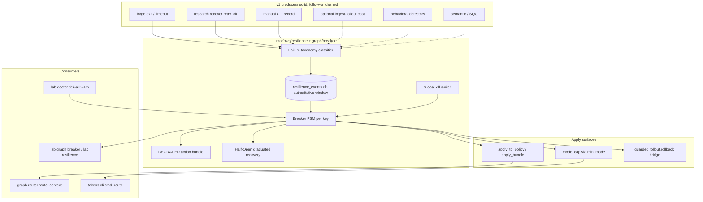
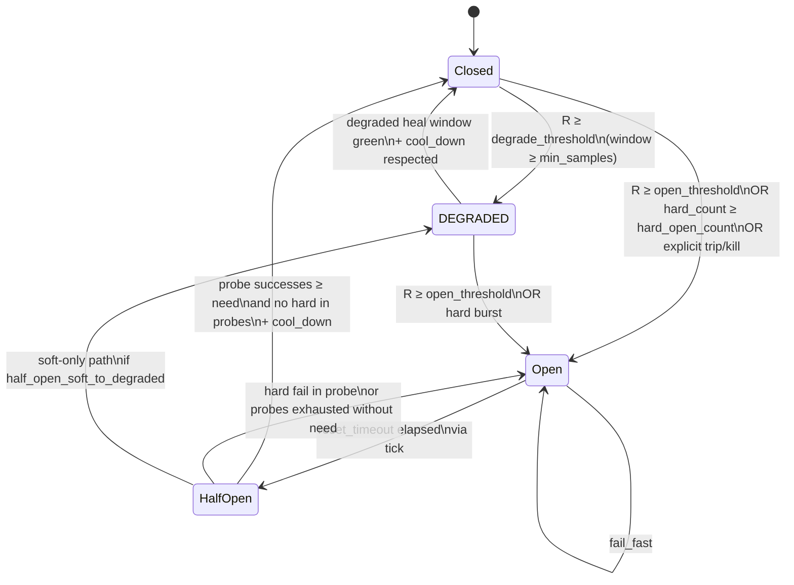
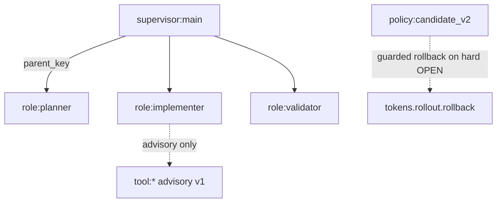
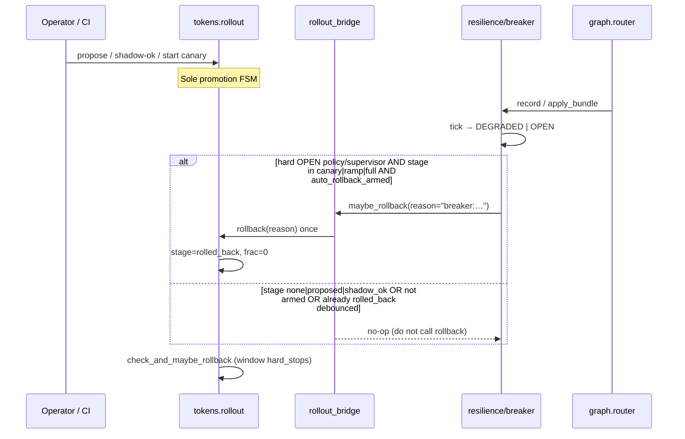
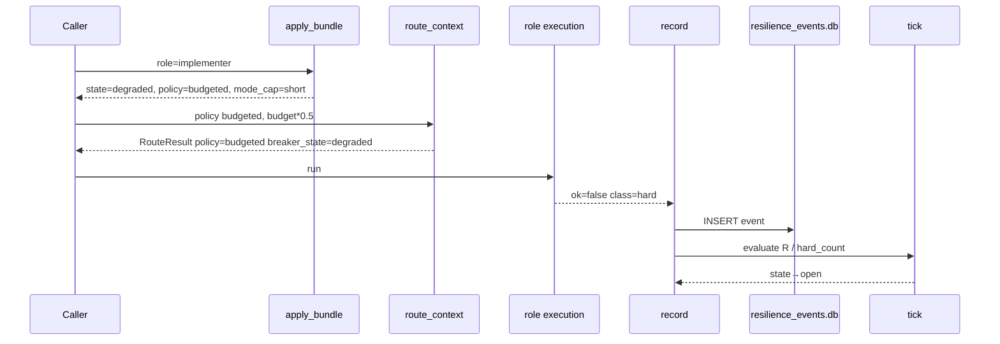

# Agentic Circuit Breakers for Grok Star Lab

| Field | Value |
|-------|--------|
| **Document** | Agentic Circuit Breakers — Design |
| **Author** | Grok Star Lab design loop |
| **Date** | 2026-08-01 |
| **Status** | Draft (rev 3 — re-review) |
| **Repo** | `~/Projects/grok-home` |
| **Audience** | Senior engineers extending the free offline Mac-local control plane |
| **Python baseline** | 3.9+ (host ships 3.9.6; avoid 3.10+ syntax) |
| **Related** | `docs/research/CLOSED-LOOP-GATES.md`, `docs/research/GRAPH-CONTEXT-ROUTING.md`, `docs/TOKEN-AWARE-CONTROL-PLANE.md` |

---

## Overview

Grok Star Lab already isolates a single bad multi-agent **role** with a binary circuit breaker (`modules/graph/breaker.py`: trip → force graph policy to `budgeted` via `apply_to_policy`). Progressive delivery for routing policies lives in a separate four-stage machine (`modules/tokens/rollout.py`: shadow → canary → ramp → full) with hard-stop auto-rollback. Those two systems do not yet share a failure taxonomy, recovery FSM, or graduated degradation path: a role is either fine or fully tripped; recovery is a manual `reset`; policy and supervisor scopes have no breakers; and DEGRADED (reduce autonomy without fail-fast) is missing.

This design evolves classic Nygard/Fowler circuit breakers into **agentic circuit breakers** for LLM multi-agent graphs: Closed → **DEGRADED** → Open → Half-Open (graduated recovery), with sliding-window failure accounting, a lab-native failure taxonomy, multi-scope placement (**v1 enforced:** role / policy / supervisor / hierarchical; **tool scope advisory** until a tool bus exists), and a strict **safety-net** contract with progressive delivery—breakers may fire `lab tokens rollout rollback` on hard stops **only when rollout is armed**, and **never** become a second competing promotion FSM. Implementation prefers extending `modules/graph/breaker.py` plus optional `modules/resilience/`, free/offline only, single-user Mac-honest with schema room for multi-tenant later.

---

## Background & Motivation

### Current state (ground truth in repo)

*Verified against repo 2026-08-01; treat as implementer ground truth.*

| Component | Path | What it does today | Gap |
|-----------|------|--------------------|-----|
| Role breaker | `modules/graph/breaker.py` | JSON file `~/.grok/lab/graph_breakers.json`; `trip` / `reset` / `is_tripped` / `apply_to_policy` | Binary `tripped` bool; no Closed/Open/Half-Open; no window; no DEGRADED; no auto-probe recovery |
| Context router | `modules/graph/router.py` | RCR-style pass\|summarize\|drop; calls `apply_to_policy(role, policy)` before routing | Only policy force-down to `budgeted`; no mode/budget effects |
| Graph logs | `modules/graph/logstore.py` | SQLite `graph_routes.db` node logs (tokens, policy, role, stage) | No failure events, breaker state transitions, or KPI for OPEN/DEGRADED dwell |
| Rollout | `modules/tokens/rollout.py` | Four-stage progressive delivery; `evaluate_window_pack`; hard_stops → `_do_rollback` | Not wired to graph breakers; `rollback()` always clobbers stage (no armed check) |
| Graduation gates | `modules/tokens/gates.py` | Data bar for shadow→canary; fallback-chaos fail budget from recover `retry_ok` | Chaos metric exists; not fed into breaker taxonomy yet |
| Session lock | `modules/tokens/session_lock.py` | Pin L1 mode mid tool-loop via `apply_lock_to_route` | DEGRADED should *respect* lock (no thrash); not yet coordinated |
| Packing | `modules/tokens/policy.py` `_packing_plan` | Strategy/budgets **derived from mode** (`tight_pack` only when `MODE_SHORT`) | No independent packing override API |
| Tool gateway | — | **None** in-repo (no central allowlist interceptor for `run_terminal_command` / write) | Tool-scope breakers cannot enforce without a choke point |
| CLI | `lab graph breaker status\|trip\|reset` | Manual isolation (`bin/lab` has `graph)` case; no `resilience)` yet) | No observe/record/tick/half-open; no resilience surface |
| Tests | `tests/test_rollout.py::TestGraphBreaker` | Trip forces `budgeted` on route | No FSM, window, hierarchy, or rollout-bridge tests |

### Pain points

1. **Binary isolation is too coarse.** A flaky implementer that sometimes fails soft should not jump straight to fail-fast; it should lose deep budget and rich graph policy first (**DEGRADED**).
2. **Manual recovery.** `reset` is human-driven; classic half-open probes and graduated success windows are absent.
3. **Failure signals are scattered.** Forge exit≠0, recover `retry_ok=false`, and cost_per_success regressions are not one taxonomy a breaker can consume. *(v1 auto-producers are limited—see Failure taxonomy / producers.)*
4. **Scope is role-only.** Policy candidates under canary and supervisor/orchestrator nodes need independent bulkheads. Tool/action bulkheads are desirable but lack an enforcement choke point today.
5. **Two FSMs risk drift.** Rollout owns promotion; breakers must not invent a parallel “promote policy” path. Doctrine: **canary/window pack remains source of truth for promotion; breakers are automated safety net.**

### Why now

Multi-agent graph routing (L2) and progressive delivery (L1 policy) just closed the open GAPS (canary/rollback, frozen-vs-drift, graduation bar, session-lock). The next production-hardening step called out in session decisions is **circuit breakers at agent/supervisor level with one-switch rollback that is drilled regularly**—without rewriting the rollout machine.

---

## Goals & Non-Goals

### Goals

1. **Classic FSM support** — Closed / Open / Half-Open with sliding window (count or time), failure threshold, reset timeout, half-open probe budget, fail-fast when Open.
2. **DEGRADED intermediate state** — Reduce autonomy (mode cap, graph policy, budget; annotations for human/tools) without full isolation.
3. **Graduated recovery** — Distinct paths for DEGRADED→Closed vs Open→Half-Open→Closed; multi-sample success before Closed; conceptual alignment with four-stage delivery *as recovery confidence*, not traffic split.
4. **Lab-native failure taxonomy** — Classifier + weights for hard / structural / semantic / behavioral / cost; **v1 operational producers** limited to signals that exist (manual, recover, forge, optional cost mirror).
5. **Multi-scope placement (enforced v1)** — Role (exists), policy_id, supervisor, hierarchical parent→child. **Tool scope: schema + advisory only** until a tool bus exists.
6. **Rollout integration** — Hard breaker OPEN at policy/supervisor scope may fire guarded `rollout.rollback`; window pack stays sole promotion arbiter.
7. **Complementary resilience** — Timeouts (existing forge/arena), limited retries+jitter (later PR), bulkheads (token budgets), fallbacks, observability, kill switch. Rate-limit module optional post-v1.
8. **Free/offline, Mac-lab honest** — JSON/SQLite under `~/.grok/lab/`; no paid deps; `tenant` field present (default `"local"`).
9. **Transparent degradation** — DEGRADED/OPEN always visible in logs, CLI status; PR2 `lab resilience status` is mandatory observability.
10. **Tests in every PR** — Unit + integration against `GROK_LAB_DATA` temp dirs (existing pattern).

### Non-Goals

1. Multi-tenant SaaS CDN traffic splitting (schema-ready only).
2. Replacing or forking `modules/tokens/rollout.py` stage machine.
3. Training learned failure predictors / ML anomaly models (heuristic thresholds v1).
4. Distributed consensus or cross-host breaker state.
5. Paid observability backends (Datadog, LangSmith, etc.).
6. Semantic LLM-as-judge in the hot path (optional deferred hooks only; SQC remains the label gate).
7. **Inventing a tool allowlist / central tool gateway** in v1. Tool-scope keys may exist as advisory annotations; enforcement waits on a real choke point (arena step runner / future agent host)—see KD-17.
8. Automatic behavioral loop/thrash detectors in v1 (classifier ready; detectors follow-on).
9. Independent packing override API (packing stays derived from mode via `_packing_plan`).

---

## Key Decisions

| # | Decision | Rationale |
|---|----------|-----------|
| **KD-1** | **Breakers are a safety net; rollout owns promotion.** Breaker OPEN on `scope=policy` or `scope=supervisor` may call `tokens.rollout.rollback(reason=…)` **only if** `stage ∈ {canary, ramp, full}` **and** `auto_rollback_armed` **and** not already `rolled_back` within debounce. Breakers **never** call `advance` / `start_canary` / increase `traffic_frac`. | Prevents dual-FSM thrash; `rollout.rollback()` itself has no armed guard—bridge must supply it. |
| **KD-2** | **Four states: Closed → DEGRADED → Open → Half-Open.** DEGRADED sits between Closed and Open; Half-Open only entered from Open after `reset_timeout` via `tick`. | Classic Nygard lacks DEGRADED; agentic systems need “reduce autonomy” before fail-fast. |
| **KD-3** | **Extend `modules/graph/breaker.py` as state + apply hooks; add `modules/resilience/` for taxonomy, event store, bridge, CLI.** | Minimal churn to `apply_to_policy` call sites. |
| **KD-4** | **Unified key** `scope:name` (e.g. `role:implementer`, `policy:candidate_v2`, `supervisor:main`). Hierarchy via optional `parent_key`. Tool keys allowed in schema but advisory in v1. | One model; multi-tenant later via `tenant`. |
| **KD-5** | **DEGRADED maps to lab primitives with enforced vs annotate split.** Enforced in PR3: graph policy→budgeted, budget_frac, mode_cap (implies packing via mode). Annotate-only until consumers exist: `low_confidence`, `require_human`, `deny_tools`. | Avoids inventing fake levers; packing is not independent of mode. |
| **KD-6** | **Failure weights by taxonomy class; successes have weight `success_weight` default 1.0.** Absolute hard burst `hard_open_count` can force Open. | Unambiguous window math for implementers. |
| **KD-7** | **Two recovery algorithms** (see Recovery matrix): DEGRADED heal vs Half-Open probe set; not interchangeable counters. | Stochastic agents need clearer heal rules than a single probe. |
| **KD-8** | **Session lock wins for mode mid-loop.** While locked, do not change mode; set `preferred_mode_cap` on the breaker record; apply on unlock / next unlocked route. Graph policy + budget_frac still apply while locked. | SAAR continuity (`session_lock.py`). |
| **KD-9** | **SQLite (`resilience_events.db`) is authoritative for sliding windows.** JSON holds state/config/counters/half_open probe tallies only—not the event ring. | Single source of truth for `tick` ratios; avoids desync. |
| **KD-10** | **CLI: `lab graph breaker …` compat; `lab resilience …` full surface.** PR2 must add `resilience)` case in `bin/lab`. | Docs stay green; discoverability. |
| **KD-11** | **Kill switch = refuse new scoped work** (`fail_fast` in apply_bundle / force local+budgeted). Does **not** SIGKILL in-flight forge/arena processes. Env `GROK_RESILIENCE_KILL=1` or `lab resilience kill` / `unkill`. | Safe emergency stop for single-user lab. |
| **KD-12** | **Semantic failures deferred** (`semantic_enabled=false`). | Free/offline honesty. |
| **KD-13** | **Single-writer assumption** for `graph_breakers.json` and events DB (same as rollout/session_lock lab honesty). Concurrent writers undefined; document “one operator / one agent process.” Optional file lock later; not v1. | Matches rest of lab state files. |
| **KD-14** | **Half-open probe admission:** any invocation of the **probe key’s own scope** after Open→Half-Open counts as a probe until `half_open_max_probes` exhausted; not sticky-session-gated in v1 (lab single-user). Concurrent probes increment the same counters under single-writer. | Simple; sufficient for Mac lab. |
| **KD-15** | **Policy Open/DEGRADED/Half-Open never graph-fail_fast.** Tokens serve path: always **serve baseline** (`baseline_policy_id`) when policy key is open, degraded, **or** half_open (`half_open_shadow=true` default for `scope=policy`). Sticky cohort still measures traffic_frac; candidate is not served while unhealthy. Graph `route_context` ignores policy Open for empty-route fail_fast. Policy Open **may** fire guarded `maybe_rollback_from_breaker` (side effect, not fail_fast). | Separates L1 policy isolation from L2 role fail-fast; matches Placement table. |
| **KD-16** | **Parent DEGRADED does not mutate child state fields.** Only **effective merge at apply time** applies parent caps. Child keys retain their own FSM state. | Avoids cascade state corruption. |
| **KD-17** | **Tool scope is advisory in v1.** `deny_tools` appears in bundle for CLI/logs; no central tool interceptor. Goal #5 tool placement deferred for enforcement. | Aligns with Non-goal 7 and missing tool bus. |
| **KD-18** | **Scope-specific Open + probe-aware merge** (not pure max). Role Open → fail_fast; supervisor Open → fail_fast **only if** `propagate_fail_fast_to_children`; policy Open → serve_baseline only. Half-Open uses caller-specific primary key (KD-20). | Fixes policy-as-fail_fast bug and dead propagate flag. |
| **KD-19** | **Compat:** `is_tripped(role)` ≡ role key is **Open**, or supervisor Open **with** `propagate_fail_fast_to_children`. DEGRADED → False. Policy Open does **not** make `is_tripped(role)` true. New `is_constrained(role)` ≡ role Open \| role DEGRADED \| propagated supervisor fail_fast \| supervisor DEGRADED caps. Manual `trip` → Open always works regardless of `GROK_RESILIENCE`. | Avoids silent DEGRADED under “tripped”; policy isolation is not role trip. |
| **KD-20** | **Primary key for Half-Open probes is caller-specific:** `route_context` → `role:{role}`; tokens serve → `policy:{policy_id}` if set else none. Only the primary key’s half_open state drives probe autonomy for that call. | Avoids dual half_open ambiguity. |

### DEGRADED → lab primitives (KD-5 detail)

#### Enforced in PR3 (real consumers exist or are added)

| Lab lever | Closed | DEGRADED | Open (fail-fast) | How enforced |
|-----------|--------|----------|------------------|--------------|
| Graph policy | requested `full`/`budgeted`/`role_aware` | Force `budgeted` via `apply_to_policy` / `apply_bundle` | Keep `policy` field as `budgeted` (or configured fallback); set `fail_fast=True`, empty selected slices | `router.route_context` |
| Budget | `allocate_budget` / ROLE_BETA | Multiply by `degraded_budget_frac` (default **0.5**) after allocate | No allocation needed; return empty route | router multiplies `budget` |
| L1 mode | EV route as usual | `mode = min_mode(mode, degraded_mode_cap)` default cap **`short`** | Prefer skip agent work for scope; if invoked, force `local` where meaningful | `cmd_route`: EV → session lock → mode_cap (see order below) |
| Packing | From mode via `_packing_plan` | **Not a separate lever** — cap-at-`short` implies `strategy=tight_pack`, lower ctx, `subagents=0` | N/A | derived only |
| Session lock | Unchanged | Mode pin wins mid-loop; persist `preferred_mode_cap` for post-release | Do not start **new** tool loops when fail_fast | `session_lock` + breaker field |

#### Annotate-only until a consumer exists (bundle fields)

| Annotation | DEGRADED | Open | Consumer status |
|------------|----------|------|-----------------|
| `low_confidence` | `true` | `true` | Surfaced in CLI/JSON; no agent host field today |
| `require_human` | `true` for high-impact | `true` | Operator-visible only in v1 |
| `deny_tools` | Config list (default **[]**) | Same list or `["*"]` advisory | **No tool gateway** — log only (KD-17) |
| Research recover throttle | — | — | Recover remains explicit `lab research recover`; on `retry_ok=false` **producer** records hard failure (does not “allow one recover” as a breaker-owned loop) |

#### `min_mode` ordering (new helper; does not exist today)

```python
# modules/graph/breaker.py or modules/resilience/mode_cap.py
MODE_RANK = {"local": 0, "short": 1, "medium": 2, "deep": 3}

def min_mode(a: str, b: str) -> str:
    """Return the lower-autonomy mode (never escalates)."""
    ra, rb = MODE_RANK.get(a, 1), MODE_RANK.get(b, 1)
    return a if ra <= rb else b
```

#### Tokens route order (PR3 normative)

```text
1. EV route_task → suggested mode
2. apply_lock_to_route(mode) → locked mode wins if active
3. If NOT locked: apply mode_cap from apply_bundle via min_mode (never escalate)
4. If locked AND breaker wants lower cap: set preferred_mode_cap on breaker record;
   do not change locked_mode; apply preferred_mode_cap on release / next unlocked route
5. packing always from final mode via _packing_plan
```

---

## Proposed Design

### Architecture



### Classic + agentic FSM



### State machine fields (per breaker key)

```python
# Stored under keys[key] in graph_breakers.json — NO event ring here
{
  "key": "role:implementer",
  "scope": "role",            # role | policy | supervisor | tool (advisory)
  "name": "implementer",
  "tenant": "local",
  "parent_key": "supervisor:main",  # optional hierarchy
  "state": "closed",          # closed | degraded | open | half_open
  "state_entered_ts": 0.0,
  "preferred_mode_cap": None, # set when degraded under session lock; cleared on apply after unlock
  "config": {
    "window_kind": "count",   # count | time
    "window_size": 20,        # last N events or seconds
    "degrade_threshold": 0.35,
    "open_threshold": 0.60,
    "min_samples": 5,
    "success_weight": 1.0,    # every success event contributes this mass
    "hard_open_count": 3,     # absolute hard fails in window → Open (bypasses min_samples)
    "reset_timeout_s": 300.0,
    "half_open_max_probes": 5,
    "half_open_success_need": 3,
    "half_open_budget_frac": 0.75,  # max(degraded_frac, this) during probe
    "half_open_soft_to_degraded": False,  # opt-in
    "success_window_samples": 5,    # DEGRADED heal window size
    "cool_down_s": 60.0,      # min dwell in Closed after recovery before re-DEGRADE
    "degraded_budget_frac": 0.5,
    "degraded_mode_cap": "short",
    "fallback_policy": "budgeted",
    "deny_tools": [],         # advisory v1
    "propagate_fail_fast_to_children": True,  # supervisor OPEN → children fail_fast ONLY if true
    "child_hard_to_parent_window": True,      # child hard events also recorded on parent key
    "fire_rollout_rollback": False,  # default True for policy/supervisor scopes
    "half_open_shadow": True,        # policy scope: serve baseline during half_open (default)
  },
  "half_open": {
    "probes_used": 0,
    "successes": 0,
    "failures": 0,
    "hard_in_probes": 0
  },
  "counters": {
    "total_failures": 0,
    "total_successes": 0,
    "trips_to_open": 0,
    "trips_to_degraded": 0
  },
  "closed_entered_ts": None,  # for cool_down
  "last_reason": "",
  "history": [],              # last 50 transitions {ts, from, to, reason}
  "updated_ts": 0.0
}
```

**Backward compatibility:** v1 file shape `{"roles": {"implementer": {"tripped": true, ...}}}` is migrated on load:

- `tripped: true` → `state: open`, key `role:implementer`
- `fallback_policy` preserved
- `roles` retained as a **derived view**: `tripped = (state == "open")` for old callers of `is_tripped`

### Failure taxonomy

| Class | Examples (lab signals) | Default weight | Typical transition |
|-------|------------------------|----------------|--------------------|
| **hard** | Exception uncaught; forge/arena exit≠0; timeout; `recover.retry_ok=false`; hard safety / POLICY_VIOLATION | 1.0 | Fast path to Open if burst (`hard_open_count`) |
| **structural** | Malformed inputs at known validators; graph memory not list (when caller records); JSON decode fail | 0.8 | DEGRADED → Open |
| **semantic** | Optional judge / SQC reject *(deferred; `semantic_enabled=false`)* | 0.5 | DEGRADED only |
| **behavioral** | Loop / thrash *(detectors follow-on; classifier ready)* | 0.6 | Prefer DEGRADED |
| **cost** | Token spike; cost_per_success regression from window pack (`ingest-rollout`) | 0.4 | DEGRADED; Open only if paired with hard |

Classifier API:

```python
# modules/resilience/taxonomy.py
def classify_event(event: Dict[str, Any]) -> Tuple[str, float]:
    """Return (class_name, weight). Never raises — unknown → structural 0.5."""
```

#### Producers: v1 operational vs follow-on

| Producer | When | Class | PR |
|----------|------|-------|-----|
| Manual `lab resilience record` / `lab graph breaker record` | Operator | any / hint | PR2 |
| Manual `trip` | Operator | synthetic hard | PR1 (compat) |
| `research.recover` when `retry_ok is False` | Auto if `GROK_RESILIENCE=1` | hard | PR3b |
| Forge / arena nonzero exit or timeout | Auto if `GROK_RESILIENCE=1` | hard | PR3b |
| `lab resilience ingest-rollout` | Optional / cron / operator | cost (soft) | PR4+ |
| Behavioral loop/thrash detectors | **Not v1** | behavioral | follow-on |
| Semantic / SQC auto | **Not v1** unless semantic_enabled | semantic | follow-on |

**Honesty:** Automatic DEGRADED in v1 is driven by real hard producers + manual records + optional cost mirror—not by unbuilt loop detectors. Taxonomy classes beyond hard/cost/structural are **classifier-ready**, not fully operational.

### Sliding window (normative math)

**Source of truth:** events in `resilience_events.db` for `breaker_key` (KD-9). JSON does **not** store `window.events`.

**Success weight:** every success event is stored with `ok=1`, `class="success"`, `weight = config.success_weight` (default **1.0**).

**Failure weight:** from taxonomy (or explicit `weight=` override on `record`).

```text
fail_mass = sum(weight_i for events with ok=0 in window)
total_mass = sum(weight_j for all events in window)   # successes contribute success_weight
R = fail_mass / max(epsilon, total_mass)              # epsilon = 1e-9; empty window → skip ratio
hard_count = count(events with ok=0 and class=hard in window)
```

**Window membership:**

- `window_kind=count`: last `window_size` events by `ts` desc for that key.
- `window_kind=time`: events with `ts >= now - window_size` seconds.

**Transition evaluation (`tick` / end of `record`):**

1. If kill switch active → effective Open for apply (state keys unchanged unless global policy says mark).
2. If state is Open and `now - state_entered_ts >= reset_timeout_s` → Half-Open (reset half_open counters).
3. If state is Half-Open → only probe rules (see Recovery matrix); do not apply ratio Open from full window until back to Closed/DEGRADED/Open.
4. Else if `hard_count >= hard_open_count` → Open (**bypasses** `min_samples`).
5. Else if `n_events < min_samples` → no ratio-based transition.
6. Else if `R >= open_threshold` → Open.
7. Else if `R >= degrade_threshold` and state is Closed → DEGRADED (respect cool_down: if recently entered Closed and `now - closed_entered_ts < cool_down_s`, stay Closed).
8. DEGRADED heal: see Recovery matrix (not pure “R low”).

**Unit fixtures (required in tests):**

| Sequence (weights) | n | R | Expected |
|--------------------|---|---|----------|
| 3× success(1.0) | 3 | 0 | stay Closed (below min_samples if min=5) |
| 5× success | 5 | 0 | Closed |
| 2 hard(1)+3 success(1) | 5 | 0.4 | DEGRADED if degrade=0.35 |
| 3 hard(1)+2 success(1) | 5 | 0.6 | Open if open=0.60 |
| 3 hard only | 3 | 1.0 | Open via hard_open_count=3 even if min_samples=5 |
| 4 cost(0.4)+1 success(1.0) | 5 | 1.6/2.6≈0.615 | **Open** (R≥`open_threshold` 0.60) |
| 2 cost(0.4)+3 success(1.0) | 5 | 0.8/4.2≈0.190 | **Closed** (R < degrade 0.35; above min_samples) |
| 5 cost(0.4) only | 5 | 2.0/2.0=1.0 | **Open** (R≥0.60); not via hard_open_count |

### Recovery matrix (KD-7)

| Path | Entry | Autonomy during recovery | Success criteria → Closed | Failure criteria |
|------|-------|--------------------------|---------------------------|------------------|
| **DEGRADED heal** | From DEGRADED while R drops and successes accumulate | Full DEGRADED bundle: policy=fallback, mode_cap retained, budget_frac=`degraded_budget_frac` | Last `success_window_samples` events in SQLite window are all `ok=1` **and** no hard class in that slice **and** `R < degrade_threshold` | Any hard → toward Open via normal rules; soft fails keep DEGRADED |
| **Half-Open probes** | From Open after `reset_timeout` + `tick` | **Probe autonomy (reduced, not full):** graph policy = **requested** (allow experiment) OR keep fallback if `half_open_use_fallback_policy=true` (default **false** = allow requested); **mode_cap still applied** until Closed; **deny_tools advisory still listed**; **budget_frac = max(degraded_budget_frac, half_open_budget_frac)** default max(0.5, 0.75)=**0.75**; `fail_fast=false` for probe key | `half_open.successes >= half_open_success_need` **and** `hard_in_probes == 0` **and** probes_used ≥ need (lab default need **3** of max **5**) | Any hard in probe → Open immediately; if probes exhausted without need → Open |
| **Half-Open soft→DEGRADED** | Opt-in `half_open_soft_to_degraded=true` | — | Soft failures only after some successes | Lands DEGRADED instead of re-Open |
| **cool_down_s** | After any → Closed | — | Blocks Closed→DEGRADED for `cool_down_s` (default **60**) | Does not block explicit `trip` or hard_open_count |

**Shadow observe (breaker-local, not rollout shadow):** for `scope=policy`, **`half_open_shadow` defaults to `true`**. While policy key is half_open, degraded, or open, tokens **serve always baseline** (KD-15). Probe successes for policy recovery are recorded via dual-log / operator `record` with detail `shadow_probe` (or automatic compare when present)—**not** by serving the candidate. Does **not** write `rollout_state.json` or call rollout `shadow_compare`. Distinct from Stage-1 rollout shadow. Role half_open still allows **requested** graph policy (Recovery matrix).

**Stochastic variance:** LLM roles are noisy; defaults use **3 successes of 5 probes** (not 2/3) and multi-sample DEGRADED heal. Operators may tighten via `breaker_bar.json`. Flapping mitigated by `cool_down_s` in **config**, not only Risks.

Alignment with four-stage progressive delivery (conceptual, **not shared state**):

| Recovery confidence | Breaker meaning | Rollout analogue |
|---------------------|-----------------|------------------|
| Shadow observe | Optional policy half-open log-only serve baseline | Stage 1 shadow |
| Canary probes | Half-open limited probes | Stage 2 1–5% |
| Ramp samples | DEGRADED multi-sample heal / probe need | Stage 3 windows |
| Full closed | Normal autonomy | Stage 4 full |

**Explicit non-coupling:** breaker recovery never advances rollout `traffic_frac`. PR4 test invariant: after any breaker transition suite, `traffic_frac` never increases.

### Placement model



| Scope | Key pattern | v1 enforcement | Open behavior | DEGRADED behavior |
|-------|-------------|----------------|---------------|-------------------|
| `role` | `role:implementer` | **Yes** | Empty route + `fail_fast=true`; graph `policy` field stays fallback | Force graph `budgeted`, cut budget, mode_cap |
| `policy` | `policy:<id>` | **Yes** (tokens serve) | **`serve_baseline=true`**, `fail_fast=false` on graph; guarded rollback if armed | Same: serve baseline (KD-15); graph route continues |
| `supervisor` | `supervisor:main` | **Yes** | Child `fail_fast` **only if** `propagate_fail_fast_to_children=true` | Effective child caps at apply (KD-16: no child state mutation) |
| `tool` | `tool:…` | **Advisory only** | Bundle `deny_tools` annotated; **no runtime deny** | Same |
| hierarchical | `parent_key` | Accounting + apply merge | See flags below | Parent DEGRADED → effective merge only |

#### Hierarchy flags (separated)

| Flag | Direction | Default | Meaning |
|------|-----------|---------|---------|
| `child_hard_to_parent_window` | child → parent | **true** | On child hard `record`, also append a hard event to parent key’s SQLite window |
| `propagate_fail_fast_to_children` | parent → children | **true** for supervisor | When **supervisor** state is Open, child role `apply_bundle` sets `fail_fast` **only if this flag is true**. If false, supervisor Open does **not** empty child routes (flag is meaningful, not dead). |

Do **not** implement “any child fail isolates all siblings”; soft child failures never open parent by default. Supervisor Open with `propagate=false` isolates only the supervisor key’s own accounting—not children.

#### Effective-state resolution — **scope-specific Open + probe-aware** (KD-18 / KD-20)

```text
function apply_bundle(role, tool="", policy_id="", supervisor="main",
                      caller="route_context"):  # or "tokens_serve"
  R = state(role:{role})
  S = state(supervisor:{supervisor})
  P = state(policy:{policy_id}) if policy_id else closed
  # tool is advisory only — never sets fail_fast

  # --- closed defaults (always start here; override below) ---
  bundle = {
    fail_fast: false,
    budget_frac: 1.0,
    mode_cap: null,
    policy: <requested graph policy passthrough>,  # full|budgeted|role_aware
    serve_baseline: false,
    baseline_policy_id: null,
    deny_tools: [],
    low_confidence: false,
    require_human: false,
    breaker_state: "closed",
    breaker_key: "role:{role}",
    state: "closed",
  }

  if kill_active:
    return fail_fast_bundle(policy=fallback)   # all scopes

  # 1) ROLE open → graph fail-fast for this role only
  if R == open:
    return fail_fast_bundle(role R, policy=R.fallback or "budgeted")

  # 2) SUPERVISOR open → child fail-fast ONLY if propagate flag on S
  if S == open and S.config.propagate_fail_fast_to_children:
    return fail_fast_bundle(reason="supervisor_propagate", policy=fallback)
  # if S == open and NOT propagate: do NOT fail_fast; may still merge
  # supervisor DEGRADED caps below if S is degraded (open supervisor with
  # propagate=false contributes no fail_fast and no degraded caps unless
  # we treat open-as-strict; v1: open+!propagate = no graph effect on children)

  # 3) POLICY open | degraded | half_open → tokens isolation only (never graph fail_fast)
  if P in (open, degraded, half_open):
    bundle.serve_baseline = true
    bundle.baseline_policy_id = rollout.baseline_policy_id  # or configured
    bundle.low_confidence = true
    if P == open and P.config.fire_rollout_rollback:
      maybe_rollback_from_breaker("policy:…", reason=…)  # side effect; guarded
    # graph policy field unchanged by P alone
    bundle.breaker_state = P  # annotate; state may be refined below
    bundle.breaker_key = "policy:{policy_id}"

  # 4) Primary key for Half-Open probes (KD-20)
  if caller == "route_context":
    primary = role:{role}
  elif caller == "tokens_serve":
    primary = policy:{policy_id} if policy_id else None
  else:
    primary = role:{role}

  if primary is not None and state(primary) == half_open:
    # Role primary: probe autonomy (requested graph policy, budget_frac 0.75, mode_cap)
    # Policy primary: still serve_baseline (half_open_shadow default true); count probe
    #   on policy key only — do not serve candidate
    if primary.scope == "role":
      bundle = half_open_role_probe_bundle(primary, base=bundle)
      # Sibling role/supervisor DEGRADED only tightens mode_cap / budget_frac
      # Policy serve_baseline from step 3 still applies if P unhealthy
    elif primary.scope == "policy":
      bundle.serve_baseline = true   # always while policy half_open
      # tokens path uses baseline; probe tallies via record, not candidate serve
    # Role Open already returned; supervisor propagate already returned
    # Sibling DEGRADED does NOT cancel probe
    return merge_degraded_caps(bundle, R, S)  # tighten only; no fail_fast

  # 5) DEGRADED merge (role + supervisor only for graph levers)
  if R == degraded or S == degraded:
    bundle.policy = fallback if R == degraded else bundle.policy
    # if R degraded: force budgeted; budget_frac *= degraded_budget_frac
    # if S degraded: min_mode / min budget_frac across S+R (KD-16 apply-time only)
    bundle.mode_cap = min_mode_nonnull(R.mode_cap, S.mode_cap)
    bundle.budget_frac = min_frac(R, S, default=1.0)
    bundle.low_confidence = true
    bundle.breaker_state = "degraded"
    if R == degraded:
      bundle.breaker_key = "role:{role}"
    return bundle

  # 6) Closed (possibly with serve_baseline from policy step 3)
  if bundle.serve_baseline:
    bundle.state = P  # open|degraded|half_open annotation for tokens
    return bundle
  return bundle  # pure closed defaults
```

**Caller convention:** `route_context` always passes `caller="route_context"`. Tokens serve path passes `caller="tokens_serve"` and must honor `serve_baseline` / `baseline_policy_id` when set. Graph router **only** empties the route when `fail_fast=true`.

**Examples:**

| role | policy | supervisor | propagate | caller | Result |
|------|--------|------------|-----------|--------|--------|
| closed | **open** | closed | — | either | `serve_baseline=true`, **`fail_fast=false`**, graph route proceeds; maybe_rollback if armed |
| closed | degraded | closed | — | tokens_serve | serve baseline; graph unconstrained by policy |
| half_open | closed | closed | — | route_context | Role probe bundle; requested graph policy; fail_fast=false |
| half_open | open | closed | — | route_context | Role probe + serve_baseline annotate; still probes role |
| closed | half_open | closed | — | tokens_serve | serve baseline (shadow); policy probe tallies; not candidate |
| half_open | closed | degraded | — | route_context | Role probe + tighter mode_cap/budget from supervisor DEGRADED |
| closed | closed | **open** | **true** | route_context | **fail_fast** (propagate) |
| closed | closed | **open** | **false** | route_context | **not** fail_fast; graph proceeds |
| open | closed | closed | — | route_context | fail_fast for role |
| degraded | closed | closed | — | route_context | budgeted + budget cut + mode_cap |
| closed | closed | closed | — | either | closed defaults passthrough |

### Integration with progressive delivery



#### Normative bridge API (`modules/resilience/rollout_bridge.py`)

```python
def maybe_rollback_from_breaker(key: str, reason: str) -> Dict[str, Any]:
    """
    Call tokens.rollout.rollback ONLY when:
      - load_state()["stage"] in ("canary", "ramp", "full")
      - load_state()["auto_rollback_armed"] is True
      - not (stage == "rolled_back" and now - rollback_ts < debounce_s)  # default 60s
    Reason MUST be prefixed "breaker:{key}:{reason}".
    Never call private _do_rollback without these guards.
    Never call advance / start_canary / mutate traffic_frac upward.
    Idempotent: second fire within debounce returns {ok: True, skipped: "debounce"}.
    """
```

**Tests (PR4 gate):**

1. `stage=none` + policy OPEN → rollout state **unchanged**.
2. `stage=canary`, `auto_rollback_armed=True` + policy OPEN → `rolled_back`, `traffic_frac==0`, once.
3. Double fire within debounce → single effective rollback.
4. Suite of breaker transitions → `traffic_frac` never increases.

Rules:

1. `evaluate_window_pack` hard_stops continue to call `_do_rollback` as today (rollout-internal).
2. Bridge uses public `rollback` only under guards above.
3. Breaker does **not** implement shadow similarity or frozen eval.
4. Cost-class soft signals optional via `ingest-rollout`.

### Apply hooks (API)

```python
# modules/graph/breaker.py (extended)

def is_tripped(role: str) -> bool:
    """True iff role Open, or supervisor Open with propagate_fail_fast_to_children.
    Policy Open → False. DEGRADED → False (KD-19)."""

def is_constrained(role: str) -> bool:
    """True iff role Open|DEGRADED, or propagated supervisor fail_fast, or supervisor DEGRADED caps apply."""

def apply_to_policy(role: str, policy: str) -> str:
    """Role Open or DEGRADED → fallback_policy. Half-open role probe: requested. Policy scope ignored here."""

def apply_bundle(
    role: str,
    *,
    tool: str = "",
    policy_id: str = "",
    supervisor: str = "main",
    caller: str = "route_context",  # "route_context" | "tokens_serve"
    requested_policy: str = "role_aware",
) -> Dict[str, Any]:
    """
    Scope-specific Open + probe-aware multi-scope resolution (KD-18/20).

    Closed / passthrough defaults (normative — always present):
      {
        "state": "closed",
        "fail_fast": False,
        "budget_frac": 1.0,
        "mode_cap": None,
        "policy": <requested_policy passthrough>,  # full|budgeted|role_aware only
        "serve_baseline": False,
        "baseline_policy_id": None,
        "deny_tools": [],
        "low_confidence": False,
        "require_human": False,
        "breaker_state": "closed",
        "breaker_key": "role:{role}",
        "keys": [...]
      }

    Partial DEGRADED merges only override fields they constrain (e.g. mode_cap set,
    budget_frac < 1); other fields remain closed defaults. Policy-only unhealthy
    sets serve_baseline=true with fail_fast=false.
    """

def record(key, *, ok: bool, class_hint=None, detail="", weight=None) -> Dict:
    """Insert into resilience_events.db; update counters; tick; save JSON state."""

def tick(key: Optional[str] = None) -> Dict:
    """Open→Half-Open timeouts; ratio transitions. key=None → all keys. State-advancing."""
```

#### Router change (OPEN shape — no synthetic policy string)

```python
# modules/graph/router.py — route_context
bundle = apply_bundle(role, caller="route_context", requested_policy=policy)
if bundle.get("fail_fast"):
    return RouteResult(
        role=role, stage=stage, budget=0,
        policy=bundle.get("policy") or "budgeted",  # stay in {full,budgeted,role_aware}
        selected=[],
        decisions=[SliceDecision(
            id="_breaker", action="drop", alpha=0, tokens=0, tokens_after=0,
            reason="breaker_fail_fast",
        )],
        # payload: breaker_state, breaker_key, fail_fast
    )
# Policy Open alone never hits fail_fast; graph continues
policy = bundle.get("policy") or policy
budget = int((budget or allocate_budget(...)) * float(bundle.get("budget_frac", 1.0)))
```

#### Tokens serve (policy isolation)

```python
# tokens serve / cmd_route when policy_id active and GROK_RESILIENCE=1
bundle = apply_bundle("main", policy_id=active_policy_id, caller="tokens_serve")
if bundle.get("serve_baseline"):
    serve_id = bundle.get("baseline_policy_id") or rollout.baseline_policy_id
    # sticky cohort still recorded for measurement; candidate not executed
```

Extend log payload with `breaker_state` / `breaker_key` / `fail_fast` / `serve_baseline` (do not overload graph `policy`).

#### Who calls `tick`? (idle Open recovery)

Open→Half-Open **requires** `tick` (state-advancing). Obligations:

| Trigger | Behavior |
|---------|----------|
| Every `record(...)` | `tick(key)` then optionally `tick(None)` for timeouts |
| Every `lab graph route-context` | `tick(None)` once at start when `GROK_RESILIENCE=1` only |
| **`lab doctor`** | **Always** runs `tick(None)` (**state-advancing**, intentional) so idle Open can recover **without** `GROK_RESILIENCE`; additionally **warns** if any Open/DEGRADED/kill. Not read-only. |
| `lab resilience tick` | Explicit operator |
| Session token boot | Optional `lab resilience tick` if `GROK_RESILIENCE=1` |
| Idle with no traffic and no doctor | **No recovery** until one of the above |

Tests: freeze time, set Open with `state_entered_ts` old, `tick()` → half_open without new failures.

### Complementary resilience patterns

| Pattern | v1 status | Notes |
|---------|-----------|-------|
| **Timeouts** | Existing forge/arena | On timeout → hard `record` (PR3b) |
| **Retries + jitter** | **Post-v1 / PR6 optional** | Not required for breaker FSM |
| **Bulkheads** | Token budgets + fail_fast scopes | Role/policy/supervisor |
| **Fallbacks** | `fallback_policy=budgeted`, mode_cap | Via apply_bundle |
| **Rate limits** | **Post-v1** | Cut from dense PR5 |
| **Observability** | **PR2 mandatory** `lab resilience status` | KPI board optional PR6 |
| **Kill switch** | PR2 | Refuse new work only; no SIGKILL |

### Defaults (lab-scale)

| Parameter | Default | Notes |
|-----------|---------|-------|
| `window_size` (count) | 20 | |
| `min_samples` | 5 | |
| `success_weight` | **1.0** | |
| `hard_open_count` | **3** | Absolute hard burst |
| `degrade_threshold` | 0.35 | |
| `open_threshold` | 0.60 | |
| `reset_timeout_s` | 300 | `GROK_BREAKER_FAST=1` → short |
| `half_open_max_probes` | **5** | Raised for stochastic agents |
| `half_open_success_need` | **3** | |
| `half_open_budget_frac` | 0.75 | |
| `success_window_samples` | 5 | DEGRADED heal |
| `cool_down_s` | **60** | In config + breaker_bar |
| `degraded_budget_frac` | 0.5 | |
| `degraded_mode_cap` | `short` | Implies tight_pack packing |
| `half_open_shadow` (policy scope) | **true** | Always serve baseline while policy half_open |
| `rollback_debounce_s` | 60 | Bridge |

Override: `~/.grok/lab/breaker_bar.json`.

### Storage layout (KD-9)

```text
~/.grok/lab/
  graph_breakers.json      # v2 state/config/counters ONLY (no event ring)
  breaker_bar.json         # optional threshold overrides
  resilience_events.db     # AUTHORITATIVE window + KPI history
  resilience_kill.json     # {active, reason, ts}
  rollout_state.json       # owner: tokens.rollout
```

**Rebuild on load:** if JSON state exists but events missing, windows are empty (conservative: no auto Open from empty); counters in JSON are informational. If events exist without key in JSON, `tick` may create default key on first record.

```sql
CREATE TABLE IF NOT EXISTS events (
  id TEXT PRIMARY KEY,
  ts REAL NOT NULL,
  tenant TEXT,
  breaker_key TEXT NOT NULL,
  ok INTEGER NOT NULL,
  class TEXT,
  weight REAL,
  detail TEXT,
  session_id TEXT,
  payload_json TEXT
);
CREATE INDEX IF NOT EXISTS idx_events_key_ts ON events(breaker_key, ts);
```

JSON writes: on **state transition**, config change, counter bump batch—not necessarily every success if counters updated in same transaction as event insert (implementation may write JSON each record for simplicity under single-writer).

### Data flow (single role invocation)



---

## API / Interface Changes

### Python (public)

| Function | Before | After |
|----------|--------|-------|
| `is_tripped(role)` | `bool` from `tripped` | `True` iff **Open** (not DEGRADED) |
| `is_constrained(role)` | — | Open \| DEGRADED \| parent fail-fast |
| `trip` / `reset` | binary | Open / force Closed; always available |
| `apply_to_policy` | if tripped → fallback | Open **or** DEGRADED → fallback; Half-Open → requested (probe) |
| `apply_bundle` | — | probe-aware multi-scope |
| `record` / `tick` | — | events DB + FSM |
| `maybe_rollback_from_breaker` | — | guarded bridge |

### Feature-flag compatibility matrix

| Mechanism | `GROK_RESILIENCE=0` (default) | `GROK_RESILIENCE=1` |
|-----------|------------------------------|---------------------|
| Manual trip/reset/CLI record | On | On |
| `apply_to_policy` / apply_bundle if state DEGRADED/OPEN | **On** (state is real) | On |
| Auto record from forge/recover | Off | On |
| route-context auto `tick(None)` | **Off** | On |
| **`lab doctor` `tick(None)`** | **On (state-advancing)** — idle Open can recover; warn is additional | On (same) |
| tokens mode_cap / serve_baseline in cmd_route | Off | On |
| Session boot tick | Off | Optional |

**Surprise notes:**
- CLI `record` can create DEGRADED which affects routing even when flag is 0—intentional (operator explicit).
- **Doctor always advances FSM via `tick`** even when `GROK_RESILIENCE=0`, so Open→Half-Open recovery does not depend on the feature flag or live traffic. This is intentional for lab operability (health checks heal isolation).

### CLI

```bash
# Backward-compatible
lab graph breaker status|trip|reset

# Extended graph surface
lab graph breaker record --key role:implementer --fail --class hard
lab graph breaker tick
lab graph breaker show --key role:implementer

# Full surface — PR2 wires bin/lab case resilience)
lab resilience status|show|trip|reset|record|tick|kill|unkill|bar
lab resilience drill   # FULL bridge drill lands in PR4; PR2 may stub "not implemented"
lab resilience ingest-rollout
```

Exit codes: `0` ok; `2` usage; `3` fail_fast active for requested key (optional).

`reset`: non-interactive by default (tests/automation). Interactive confirm only if stdin is TTY and `--confirm` passed (not default).

### Config (`breaker_bar.json`)

```json
{
  "window_kind": "count",
  "window_size": 20,
  "min_samples": 5,
  "success_weight": 1.0,
  "hard_open_count": 3,
  "degrade_threshold": 0.35,
  "open_threshold": 0.60,
  "reset_timeout_s": 300,
  "half_open_max_probes": 5,
  "half_open_success_need": 3,
  "half_open_budget_frac": 0.75,
  "half_open_soft_to_degraded": false,
  "half_open_shadow": true,
  "success_window_samples": 5,
  "cool_down_s": 60,
  "degraded_budget_frac": 0.5,
  "degraded_mode_cap": "short",
  "semantic_enabled": false,
  "rollback_debounce_s": 60,
  "fire_rollout_rollback_scopes": ["policy", "supervisor"],
  "default_deny_tools_degraded": []
}
```

---

## Data Model Changes

### `graph_breakers.json` v2

As in state machine fields; `roles` projection: `tripped = (state == "open")`.

### Migration strategy

1. PR1: dual-read v1/v2; always write v2.
2. Events DB created on first `record` or CLI init.
3. Tests: empty dir, v1 file, v2 file.

### Multi-tenant readiness

`tenant` on keys and events; default `local`.

---

## Alternatives Considered

### Alt A — Only extend binary trip/reset (status quo+)

- **Pros:** Tiny diff. **Cons:** No DEGRADED/recovery. **Verdict:** Compat layer only.

### Alt B — Fold breaker FSM into `tokens/rollout.py`

- **Pros:** One “stage” place. **Cons:** Dual-purpose thrash. **Verdict:** Reject (KD-1).

### Alt C — Replace `graph/breaker.py` with only `resilience/`

- **Pros:** Clean boundary. **Cons:** Breaks imports/docs. **Verdict:** Extend breaker; resilience helpers.

### Alt D — Redis/Hystrix distributed

- **Verdict:** Reject free/offline Mac lab.

### Alt E — Pure Nygard three-state (no DEGRADED)

- **Pros:** Smaller FSM; Open+fallback approximates “degrade.” **Cons:** Fail-fast and “reduce autonomy” are different UX; binary trip already is Open+budgeted—DEGRADED is the product differentiator for stochastic agents that should keep working under caps. **Verdict:** Reject as primary; DEGRADED is required by brief.

### Alt F — Metrics-only breakers (never call rollout)

- **Pros:** Zero risk of clobbering rollout state; observe + doctor warn only. **Cons:** Loses automated safety net for multi-agent cascade called out in session decisions; operators must watch CLI. **Verdict:** Reject as sole design; optional `fire_rollout_rollback=false` per key remains escape hatch. Guarded bridge (KD-1) is the middle path.

### Alt G — Reuse `rollout_bar.json` keys under `breaker:` namespace vs separate `breaker_bar.json`

- **Pros of merge:** One file to tune. **Cons:** Different owners (promotion windows vs isolation thresholds); rollout bar edits risk breaking canary hours; breaker needs success_weight/hard_open_count irrelevant to rollout. **Verdict:** **Separate `breaker_bar.json`** (KD style like `graduation_bar.json` already separate). Cross-link in docs; do not dual-write.

---

## Security & Privacy Considerations

| Threat | Severity | Mitigation |
|--------|----------|------------|
| Accidental reset re-enables autonomy | Medium | Logged history; half-open still mode-capped; TTY `--confirm` optional only |
| Kill left on | Low | Doctor warn; status banner; `unkill` documented |
| Kill aborts running jobs | — | **Kill refuses new work only**; does not SIGKILL forge |
| Path injection in keys | Low | Sanitize `[a-z0-9_.:-]+` |
| Sensitive detail in events | Medium | Truncate 500 chars; dir `0700` |
| Cascade OPEN stalls all work | High | `propagate_fail_fast_to_children` explicit; per-role independent otherwise |
| Naive bridge clobbers rollout from `none` | High | **Guarded** maybe_rollback only when armed + active stage |
| Double rollback noise | Low | Debounce 60s |
| Semantic poisoning | Low | semantic_enabled=false |

Auth: single-user local trust.

---

## Observability

### PR2 acceptance (mandatory)

`lab resilience status` human + JSON:

```text
keys_total / open / degraded / half_open / closed
kill_active
events_last_hour
top_failing_keys
```

This is **sufficient v1 observability**. Mission control badges and `kpi_board.py` counters are **optional PR6**.

### Logs

- State transitions → JSON `history` + optional event row class=`transition`
- Graph node payload: `breaker_state`, `breaker_key`, `fail_fast` when non-closed
- When DEGRADED/OPEN: CLI prefix `breaker: DEGRADED role:implementer — mode_cap=short policy=budgeted`

### Alerting

- `lab doctor` **warn** (not fail) on OPEN or kill active (Open Question 3 default: warn)
- Session-close skill may mention open breakers

---

## Rollout Plan

| Stage | What | Success |
|-------|------|---------|
| Shadow | FSM + migration + CLI status/show/record/tick | Unit tests; TestGraphBreaker green |
| Canary | apply_bundle in router; mode_cap order; recover/forge producers under flag | Smoke suite no false Open |
| Ramp | Guarded rollout bridge + **full** `lab resilience drill` in CI | PR4 tests |
| Full | Optional `GROK_RESILIENCE=1` in session boot | Doctor clean |

Feature rollback: `GROK_RESILIENCE=0`; manual trip still works; delete events DB if needed.

---

## Risks

| Risk | Severity | Mitigation |
|------|----------|------------|
| Dual rollback paths | Med | Prefix `breaker:` vs `hard_stop:`; debounce |
| Window sensitivity | Med | min_samples; lab defaults; HARD path separate |
| DEGRADED thrash with lock | Med | KD-8 preferred_mode_cap |
| Half-open flapping | Med | cool_down_s in config; 3/5 probes |
| Hierarchy wrong-way cascade | High | Separated flags child_hard_to_parent vs propagate_fail_fast |
| Tool scope false sense of security | Med | KD-17 advisory explicit in CLI when deny_tools non-empty: “advisory only” |
| Idle Open never recovers | Med | tick obligations table |
| Performance JSON writes | Low | Single-writer; SQLite windows |

---

## Open Questions

| # | Question | Resolution / default for implementers |
|---|----------|--------------------------------------|
| 1 | Auto-create policy breaker on `rollout.propose`? | **Default: create on first failure or first apply_bundle with policy_id** (lazy). Propose may register empty key optionally—defer auto-create on propose. |
| 2 | Default deny_tools list? | **Default `[]`** (empty). Tool enforcement is advisory; seeding shell deny without choke point is theater. |
| 3 | Doctor fail vs warn on OPEN? | **Warn only** (exit 0 unless other fails). |
| 4 | half_open_soft_to_degraded default? | **false** (opt-in). |
| 5 | Events DB separate vs graph_routes? | **Separate `resilience_events.db`** (KD-9). |
| 6 | Arena auto-record? | **Later** after forge/recover PR3b; not PR3 core. |

---

## PR Plan

Ordered, mergeable. Python 3.9. Each PR keeps `TestGraphBreaker` green where it touches graph.

### PR1 — FSM core + migration + compat (lean)

**Depends on:** nothing  

**Files:**

- `modules/graph/breaker.py` — v2 schema, migrate, states, `record`/`tick`/`apply_bundle`/`is_constrained`, trip/reset/is_tripped/apply_to_policy
- `modules/resilience/__init__.py` — re-exports
- `modules/resilience/taxonomy.py` — weights table + classify
- `modules/resilience/events.py` — SQLite authoritative windows
- `modules/resilience/window.py` — R / hard_count helpers
- `tests/test_breaker_fsm.py` — transitions, fixtures table, v1 migration, probe-aware merge unit tests
- `tests/test_rollout.py` — TestGraphBreaker green

**Out of PR1:** CLI, doctor, forge hooks, rollout bridge, hierarchy flags beyond data fields, retry/ratelimit.

**Description:** Classic+DEGRADED FSM; SQLite events; success_weight + hard_open_count; cool_down in config.

### PR2 — CLI + observability (+ bin/lab)

**Depends on:** PR1  

**Files:**

- `modules/graph/cli.py` — record/tick/show
- `modules/resilience/cli.py` — full surface except full drill
- **`bin/lab`** — add `resilience)` case (required)
- `docs/research/CLOSED-LOOP-GATES.md` — DEGRADED + commands
- `tests/test_resilience_cli.py`

**Drill:** stub `lab resilience drill` → exit 0 with message `drill requires PR4 bridge` **or** omit subcommand until PR4. **Full drill acceptance is PR4 only.**

**Acceptance:** `lab resilience status` human+JSON mandatory.

### PR3 — Router / tokens apply hooks + producers

**Depends on:** PR1  

**Files:**

- `modules/graph/router.py` — apply_bundle, fail_fast empty route, budget_frac, payload breaker_* fields (**policy stays budgeted**)
- `modules/tokens` route path (`cli.cmd_route` / policy) — order EV → lock → mode_cap; preferred_mode_cap
- `modules/resilience/mode_cap.py` — `min_mode`
- Wire `tick(None)` on route-context
- **PR3b (same PR or immediate follow):** `research/recover.py` record hard on `retry_ok=false`; forge/arena exit→record when `GROK_RESILIENCE=1`
- Tests: degraded budgeted+budget; fail_fast shape; lock order; preferred_mode_cap

**Description:** Runtime enforcement of real levers only.

### PR4 — Guarded rollout bridge + full drill

**Depends on:** PR1; PR2 for CLI drill command  

**Files:**

- `modules/resilience/rollout_bridge.py` — `maybe_rollback_from_breaker` with full guards
- `tests/test_breaker_rollout_bridge.py` — stage=none no-op; canary armed rollback once; debounce; **traffic_frac never increases**
- `lab resilience drill` — full path

**Description:** Safety net; never advance.

### PR5 — Hierarchy only (slim)

**Depends on:** PR1–PR2  

**Files:**

- parent_key apply merge; `child_hard_to_parent_window`; `propagate_fail_fast_to_children`
- tests for hierarchy directions
- Optional `ingest-rollout` cost soft signals

**Out of PR5:** retry.py, ratelimit.py, tool enforcement gateway.

### PR6 — Docs, doctor, optional KPI, optional complementary patterns

**Depends on:** PR2–PR5  

**Files:**

- docs cross-links; optional `docs/research/AGENTIC-CIRCUIT-BREAKERS.md`
- `lib/checks.sh` / doctor — tick-all + warn OPEN/kill + unkill hint
- optional kpi_board counters
- optional retry helpers if still desired

---

## Testing strategy (required)

| Layer | Cases |
|-------|-------|
| Unit FSM | R fixtures; hard_open_count; cool_down; half_open 3/5; DEGRADED heal window |
| Scope-specific Open | policy Open → serve_baseline, fail_fast=false; supervisor Open+!propagate → no fail_fast |
| Probe-aware merge | half_open + sibling degraded still probes; supervisor open+propagate cancels |
| Taxonomy | weights; unknown default |
| Compat | v1 JSON; is_tripped Open-only; is_constrained |
| Router | DEGRADED budgeted; OPEN fail_fast with policy=budgeted not breaker_open |
| Tick idle | time freeze Open→half_open via tick alone |
| Rollout bridge | guards; debounce; traffic_frac never ↑ |
| Session lock | order; preferred_mode_cap |
| Fast mode | GROK_BREAKER_FAST |

---

## References

| Resource | Role |
|----------|------|
| Nygard, *Release It!* — Circuit Breaker | Classic Closed/Open/Half-Open |
| Fowler, CircuitBreaker | Pattern popularization |
| `modules/graph/breaker.py` | Current binary role isolation |
| `modules/graph/router.py` | `apply_to_policy` consumer |
| `modules/tokens/rollout.py` | Progressive delivery; unguarded `rollback()` |
| `modules/tokens/policy.py` | `_packing_plan` mode-derived packing |
| `modules/tokens/gates.py` | Graduation; fallback chaos |
| `modules/tokens/session_lock.py` | Tool-loop mode pin |
| `docs/research/CLOSED-LOOP-GATES.md` | Doctrine + CLI |
| `docs/research/GRAPH-CONTEXT-ROUTING.md` | L2 context |
| `docs/TOKEN-AWARE-CONTROL-PLANE.md` | L1 modes / EV |
| `tests/test_rollout.py` | Existing breaker tests |
| `bin/lab` | Must gain `resilience)` case in PR2 |

---

## Appendix A — Operator runbook

```bash
lab graph breaker trip --role implementer --reason "cascade" --fallback budgeted
lab resilience record --key role:implementer --fail --class hard --detail timeout
lab resilience tick
lab resilience show --key role:implementer
lab resilience reset --key role:implementer
lab resilience kill --reason "runaway"    # refuse new work; does not kill PIDs
lab resilience unkill
lab resilience drill                      # PR4: proves guarded rollback
lab tokens rollout drill
lab doctor                                # warns on OPEN/kill; ticks all
```

## Appendix B — Severity / merge summary

```text
kill_switch                    → fail_fast all
role Open                      → fail_fast this role (graph empty route)
supervisor Open + propagate    → fail_fast child roles
supervisor Open + !propagate   → no child fail_fast
policy Open|DEGRADED|half_open → serve_baseline on tokens; fail_fast=false on graph;
                                 maybe_rollback if open+armed (side effect)
role half_open (primary)       → probe bundle; sibling DEGRADED tightens caps only
policy half_open (tokens primary) → serve_baseline (shadow); probe tallies without candidate
role/supervisor DEGRADED       → constrained graph bundle (budgeted / budget_frac / mode_cap)
closed                         → defaults: fail_fast=false, budget_frac=1.0, mode_cap=null,
                                 policy=passthrough, annotate flags false

is_tripped(role)     ≡ role Open | (supervisor Open & propagate)
is_constrained(role) ≡ is_tripped | role DEGRADED | supervisor DEGRADED caps
```
