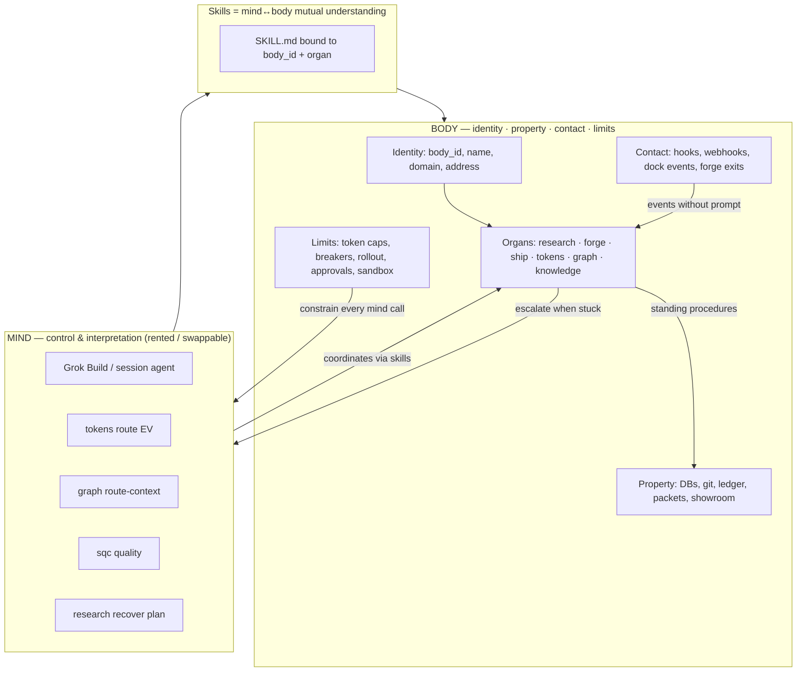
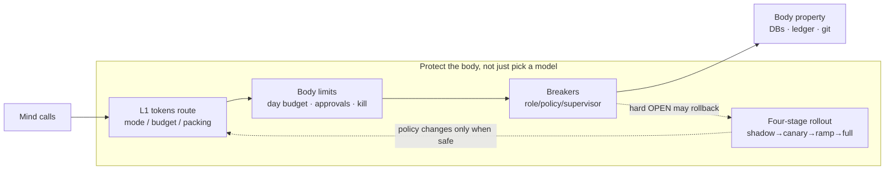

# Star Lab as Mind + Body — Agent Product Architecture

| Field | Value |
|-------|--------|
| **Document** | Star Lab as Mind + Body |
| **Author** | Grok Star Lab design loop |
| **Date** | 2026-08-01 |
| **Status** | Draft (rev 3 — resolve order + budget polish) |
| **Repo** | `~/Projects/grok-home` |
| **Audience** | Senior engineers extending the free offline Mac-local control plane (multi-tenant is schema room only) |
| **Python baseline** | 3.9+ (host ships 3.9.6; avoid 3.10+ syntax) |
| **Thesis source** | [@stablechen (Will Chen), 2026-07-24](https://x.com/stablechen/status/2080698585176494277) |
| **Related** | `docs/GROK-STAR-LAB-DESIGN.md`, `docs/TOKEN-AWARE-CONTROL-PLANE.md`, `docs/design/2026-08-01-agentic-circuit-breakers.md`, `docs/research/GRAPH-CONTEXT-ROUTING.md`, `docs/research/CLOSED-LOOP-GATES.md`, `docs/PAPER-TO-LAB-MAP.md` |

---

## Overview

Grok Star Lab is a Mac-local free control plane for Grok Build. It already routes tokens, packs context, tracks experiments, recovers failed validations, isolates bad graph roles, and ships offline artifacts. What it does **not** yet do is treat those surfaces as a **body** — durable structure with identity, property, contact with reality, and limits — that a **mind** (Grok or any rented model) inhabits.

Will Chen’s thesis is the product doctrine: customers (and operators) will not pay for another chatbot on rented lab models. Pure capability has no shape. Agents become legible and defensible when intelligence lives inside a body whose edges you can see — the same way a CRM is contacts/deals and an IDE is files/errors/builds. Coding agents work because they inherit a computer body; business and lab agents must **build** one.

This document maps mind vs body onto existing Star Lab modules, defines a first-class **Body** abstraction for lab and project work on this Mac, composes **organs** (research, forge, ship, tokens, graph, knowledge, arena) with standing procedures, ties skill/memory promotion to bodies only, shows how four-stage rollout + breakers + token policy protect the body (not just model choice), and specifies a vertical slice on the **grok-home lab body** and **starlab-demo project body**. Free/offline first. Multi-tenant is **schema room only** (`tenant: "local"`) — not a product roadmap item in this design.

---

## Background & Motivation

### Thesis (grounded)

From [@stablechen, 2026-07-24](https://x.com/stablechen/status/2080698585176494277):

1. **Labs sell intelligence.** Claude Max / Codex at ~$200 improve whether wrappers ship or not. Jasper-style collapse when the lab upgrades.
2. **Capability has no shape.** Tools and “can do anything” leak out of every container; the product is cognitively illegible.
3. **Software shape comes from edges.** CRM: contacts/deals. IDE: files/errors/builds. Agents need the same.
4. **Body** = functional tissue with reduced degrees of freedom:
   - **Identity** — name, domain, address the world uses to reach this thing
   - **Property** — money/accounts, DB rows, records that persist tomorrow
   - **Contact with reality** — inbox, sensors, feeds, webhooks — events arrive without prompting
   - **Limits** — spending caps, approvals, permissions so many model calls = one accountable thing
5. Organs → systems; mature organs carry cached procedures / standing workflows.
6. **Mind** supplies control and interpretation; the body runs most of the work.
7. **Skill** = mutual understanding of mind↔body, written down — only valuable against a body.
8. **Webhook > prompt** for receiving reality.
9. Ownership of outcomes is what makes pricing possible in principle (Chen cites Intercom Fin $0.99/resolution; Duolingo body predates GPT-4) — **illustration only; billing is a non-goal here**.
10. **Anti-wrapper test:** what remains if you swap the model and rewrite the prompts/code against public APIs?

### Current state (ground truth in repo, 2026-08-01)

Star Lab is implemented as monorepo `~/Projects/grok-home` with facade `bin/lab`, mutable state `~/.grok/lab/`, packaging into `~/.grok/` via `lab install`.

| Surface | Path | Role today | Body-lens label |
|---------|------|------------|-----------------|
| CLI facade | `bin/lab` | Routes to modules | Operator surface (mind+body UI) |
| Token control plane | `modules/tokens/` | EV route, shadow, eval, gates, four-stage rollout, session lock, distill | **Limits organ** + mind mode selection |
| Graph L2 | `modules/graph/` | Role-aware pass\|summarize\|drop; binary role breaker | **Mind carriage** + partial isolation |
| Research | `modules/research/` | Golden log, context packets, LEAD recover, KPIs | **Research organ** (property + procedure) |
| Forge | `modules/forge/` | Experiment ledger SQLite + MD | **Property organ** (runs that persist) |
| Gym | `modules/gym/` | Offline dolphin3 smoke/eval | Model probe (mind quality, not body) |
| SQC | `modules/sqc/` | Annotation quality loop | Gate on skill/memory promotion |
| Knowledge | `modules/knowledge/` | FTS5 index/query | **Property organ** (searchable corpus) |
| Design | `modules/design/` | Register design docs per project | **Property** (decisions) |
| Ship / Showroom | `modules/ship/`, `modules/showroom/` | Local checks + portfolio | **Ship organ** + public proof |
| Arena | `modules/arena/` | Offline `kind: script` pipelines; workflow handoff for Rhai | **Procedure substrate** (mind=false scripts); candidate organ runner |
| Observatory | `modules/observatory/` | Doctor snapshot → Mission Control embed | Mind-adjacent observability; not a body organ in v1 |
| Imagine | `modules/imagine/` | Offline asset verify (+ optional gen) | Mind-adjacent atelier / portfolio; not core body v1 |
| Dock | `modules/dock/` | MCP presence + offline fallbacks | Partial **contact** (optional) |
| Sandbox | `modules/sandbox/` | Seatbelt profiles | **Limits** (execution envelope) |
| SessionStart hooks | `packaging/hooks/` | Arms token policy every session | Weak contact (boot, not event bus) |
| Home runtime | `~/.grok/` memory, skills, rules, safety | Global mind scaffolding | Shared tissue, not project body |
| Demo project | `~/Projects/starlab-demo` | hello + tests + AGENTS.md; forge exit 0; gym 3/3 | Candidate **project body** (thin) |

### Pain points (why body now)

1. **Illegible product.** Operator sees modules and commands; outsiders see “Grok with extra CLI.” No single noun that owns outcomes overnight.
2. **Global property blob.** `~/.grok/lab/*.db` is multi-project soup. Forge/design take optional `--project` strings; there is no body registry, no body-scoped budgets, no body address.
3. **Contact is pull-prompt, not push-event.** Almost all work starts from a human chat or CLI. Dock/MCP and SessionStart are the only unsolicited signals; no webhook/inbox organ for lab obligations.
4. **Limits protect the model path, not the body.** Token EV, session lock, graph breaker, and rollout protect *how much mind is used* and *which policy serves*. They are not yet framed as body integrity (obligations, spend, who may mutate property).
5. **Skills float free.** `token-route`, `lab-ship`, `new-project`, `design-register` are global playbooks. Chen: a skill is only valuable against a body. Promotion (`tokens distill`, SQC gate) is not body-keyed.
6. **Wrapper risk.** If someone swaps Grok for Claude and reimplements route heuristics + packets against public APIs, too much of today’s lab value is rewritable interpretation rather than owned accumulated structure.

### Why this machine first

This is **not** a SaaS chatbot startup and not an “agent product platform” pitch. The first customer is the operator of this Mac. The bodies that must exist overnight are: the lab control plane (health, experiments, research logs, token policy learning, showroom proofs) and project repos under `~/Projects`. Schema already carries `tenant` (graph/shadow via `GROK_TENANT`, default `"local"`) so a later multi-user split does not require a rewrite — but that is **not** in v1 scope.

---

## Goals & Non-Goals

### Goals

1. **Explicit mind/body map** of every major Star Lab module (today / missing).
2. **Body abstraction** for lab projects: identity, property, contact, limits — concrete schema + on-disk layout under `~/.grok/lab/bodies/`.
3. **Organs as composable units** with standing procedures (scripts/workflows that fire without re-prompting the mind).
4. **Skill & memory promotion only against a body** — distill/SQC/memory write paths take `body_id`.
5. **Protect the body** via four-stage rollout + breakers + token policy (not only model selection).
6. **Vertical slice:** implement and operate **lab:grok-home** (control-plane body) and **project:starlab-demo** (thin project body).
7. **Anti-wrapper checklist** as a permanent design gate and CLI subcommand.
8. **CLI:** `lab body …` (plus project scaffold extension) — concrete commands in this doc.
9. **Free/offline first;** honest single-user Mac vs multi-tenant later.
10. **Mermaid diagrams**, **Key Decisions**, **PR Plan** (mandatory).

### Non-Goals

1. Building a multi-tenant SaaS control plane or billing in v1.
2. Replacing Grok Build as the primary mind, or training a private frontier model.
3. Inventing a full tool gateway / allowlist bus in the body PRs (depends on breaker KD-17; body *limits* annotate until enforcement exists).
4. Auto-ingesting all MCP events into obligations in v1 (webhook organ stub + 1–2 producers only).
5. Pricing/outcome metering product (Intercom-style) — document the shape; no Stripe.
6. Rewriting existing modules wholesale; Body is a **registry + binding layer** first.
7. Competing with GitHub/Greenhouse as general-purpose bodies — only lab/project bodies.

---

## Mind vs Body map (Star Lab today)

### Mind — control and interpretation

| Component | What the mind does | Where it lives |
|-----------|--------------------|----------------|
| Grok Build / session agent | Plans, writes, calls tools, interprets failures | External TUI / session; not in monorepo |
| `lab tokens route` | Interprets task → horizon → EV mode | `modules/tokens/policy.py` |
| `lab graph route-context` | Interprets which memory slices a role needs | `modules/graph/router.py`, `scorer.py` |
| `lab sqc` | Interprets annotation quality | `modules/sqc/` |
| `lab research recover` plan | Interprets failure → scope-cut plan | `modules/research/recover.py` |
| Skills / system rules | Written mind↔body understanding (today: mostly mind-side) | `~/.grok/skills/`, `~/.grok/rules/` |
| Gym scoring | Interprets model output quality | `modules/gym/harness.py` |

**Doctrine:** Mind is **rented and replaceable**. Lab value must not live only here.

### Body — structure that persists and receives reality

| Component | Body facet | Maturity today | Gap |
|-----------|------------|----------------|-----|
| `~/Projects/<name>` + git + tests | Property + coding body (inherited) | Strong for coding agents | Not registered as Body |
| `AGENTS.md` / project README | Weak identity | Per-repo conventions | No address / body_id |
| `~/.grok/lab/experiments.db` | Property (ledger of runs) | Strong offline | Optional `project` string only |
| `token_policy.db`, shadow, rollout | Property + limits | Strong | Global, not body-scoped |
| `research_log.db`, packets | Property + partial procedure | Strong | Not bound to body identity |
| `graph_routes.db`, breakers | Limits (role isolation) | Binary breaker; richer FSM designed | Role ≠ body |
| Knowledge FTS | Property | Project filter exists | Index not “owned records” |
| Design DB | Property | Project-keyed | No obligations |
| Showroom entries | Property (portfolio proof) | Real e2e for starlab-demo | Proof of mind work, thin body |
| SessionStart token boot | Contact (session birth) | Automatic | Not domain events |
| Dock MCP | Contact (optional) | Probe only | No webhook → obligation path |
| Safety guard + sandbox | Limits | Strong catastrophic rails | Not body spend/approval model |
| Webhooks / inbox / sensors | Contact | **Missing** | Highest-value gap |
| Body registry | Identity root | **Missing** | Required for product shape |
| Body-scoped token budgets | Limits | **Missing** | Only mode budgets |
| Standing organ procedures | Organs mature | Partial (hooks, forge --recover) | No organ scheduler |

### Split diagram



---

## Proposed Design

### Core claim

**Star Lab’s job on this Mac is not “a better router for Grok.”**  
**It is to inventory, build, and operate lab + project bodies that Grok (or any mind) inhabits.**

- Operator value today: durable **Mac-local lab + project bodies** with visible edges (identity, property, contact, limits).
- Defensibility test: anti-wrapper score — what remains after a model swap.
- Later multi-tenant reuse is schema-room only (`tenant`); not a v1 deliverable or marketing lead.

### Body abstraction

A **Body** is a first-class lab object with reduced degrees of freedom.

```text
Body
├── identity   { body_id, kind, name, domain?, address?, repo_path?, owner }
├── property   { stores[], ledger_path, git_root?, artifacts[] }
├── contact    { channels[] }   # how reality arrives unprompted
├── limits     { token_budget_day, mode_cap, breaker_scopes[], approvals[], sandbox }
└── organs     { organ_id → OrganBinding }
```

#### Identity

| Field | Example (lab body) | Example (project body) |
|-------|--------------------|------------------------|
| `body_id` | `lab:grok-home` | `project:starlab-demo` |
| `kind` | `lab` \| `project` \| `system` | `project` |
| `name` | Grok Star Lab control plane | starlab-demo |
| `domain` | local (no public DNS v1) | local |
| `address` | `lab://grok-home` (CLI/logical) | `project://starlab-demo` → `~/Projects/starlab-demo` |
| `repo_path` | `~/Projects/grok-home` | `~/Projects/starlab-demo` |
| `tenant` | `local` | `local` |

**Address** is the anti-chatbot edge: something the world (hooks, webhooks, scripts) can target without a chat open.

#### Property ownership tiers (KD-B17)

SQLite files under `~/.grok/lab/*.db` are **shared infrastructure**, not exclusive property of any one body. Claiming “lab owns all DBs” is wrong and will confuse `lab body status`.

| Tier | What counts as property | Examples |
|------|-------------------------|----------|
| **Lab body** (`lab:grok-home`) | Control-plane state + lab-repo artifacts | Body registry; rollout/shadow/token policy **global** state; lab doctor/KPI boards; forge/design/showroom rows with `project=grok-home` or `body_id=lab:grok-home`; repo `~/Projects/grok-home` |
| **Project body** (`project:*`) | Rows + paths keyed to that project | Git `repo_path`; forge/design/knowledge/showroom/research rows with matching `project_key` / `body_id`; project packets |
| **Shared infrastructure** | On-disk multi-project stores | `experiments.db`, `token_policy.db`, `research_log.db`, `graph_routes.db`, knowledge FTS files — **filtered**, not owned |

**Status UX:** show “bound stores + **row counts for this body**,” never “owns experiments.db.”  
**Migration honesty:** historical rows with `body_id NULL` may be *attributed* to `lab:grok-home` for stats only — that is soft attribution, **not hard isolation** (see Security).

Authoritative records that outlive a model call (per body):

| Store | Path pattern | Notes |
|-------|--------------|-------|
| Body manifest | `~/.grok/lab/bodies/<dir>/body.json` | Schema below |
| Body ledger | `…/ledger.jsonl` | Obligations + outcomes (v1 JSONL; KD-B4) |
| Day budget | `…/budget.json` | Pending + reconciled spend (KD-B18) |
| Bound row filters | Global DBs **filtered** by `body_id` / `project_key` | Don’t fork DBs in PR-B1 |
| Git | `repo_path` | Coding body inheritance |
| Packets | `~/.grok/lab/packets/` + `body_id` | Context packets become body property when stamped |
| Showroom | entries with `project` / `body_id` | Portfolio as body history |
| Knowledge | FTS with `project` = project_key | Searchable property filter |
| Body skills | `bodies/<dir>/skills/` | **Default landing** for promoted rules (KD-B21) |

**Ledger row (obligation):** the minimal “business memory” Chen describes — not chat transcript.

```json
{
  "id": "obl_…",
  "body_id": "project:starlab-demo",
  "kind": "validation_failed",
  "status": "open",
  "source": "forge.run",
  "source_ref": "run_abc",
  "created_ts": 0,
  "payload": {"exit_code": 1, "cmd": ["python3", "-m", "unittest"]},
  "policy": "recover_once",
  "closed_ts": null,
  "outcome": null
}
```

#### Contact with reality

| Channel | v1 | Mechanism |
|---------|----|-----------|
| `session_start` | Yes | Token SessionStart boot; may set `GROK_BODY=lab:grok-home` as **step-5 fallback only** — never `GROK_BODY_FORCE` (KD-B16) |
| `cli_event` | Yes | `lab body ingest --channel cli` for scripts |
| `forge_exit` | Yes | In-process producer after `forge.run_command` (KD-B19) |
| `research_complete` | Yes | In-process after research complete/recover |
| `ship_check` | Yes | Thin hook on existing ship path (bind auto-capture; do not reimplement) |
| `webhook` | Stub | File-drop inbox under body dir; no local HTTP required in v1 |
| `mcp_dock` | Probe only | Dock status → advisory contact health |
| `fs_watch` | Deferred | Path watchers for repo events |
| `arena_script` | Optional | `lab arena run` as mind=false procedure action substrate |
| `cron` / organ schedule | Deferred | No daemon in v1; producers are synchronous CLI hooks only |

**Doctrine:** webhook (or file-drop) **>** prompt. Prefer in-process `body.events.ingest` from producers over re-describing state in chat.

#### Default body resolution (KD-B16) — single normative algorithm

Producers and `lab tokens route` resolve the active body with **`lab body resolve`** (shared helper; pure function + registry). **One ordered rule** — no special-case prose that contradicts the list:

```text
1. Explicit --body flag
     → that body_id (must be registered or error)
2. If GROK_BODY_FORCE=1 AND GROK_BODY is set and registered
     → that body_id
3. --project P / module project_key
     → project:P if registered
4. cwd realpath under a registered body's identity.repo_path (prefix match)
     → that body
5. Else if GROK_BODY is set and registered
     → that body_id   (true session fallback)
6. Else → lab:grok-home (create-on-install default)
```

**SessionStart rules:**

- May export `GROK_BODY=lab:grok-home` so step **5** has a default when no project/cwd match.
- Must **never** set `GROK_BODY_FORCE` (FORCE is operator-only escape hatch).
- Consequence: under a normal session with `GROK_BODY=lab:grok-home`,  
  `lab forge run --project starlab-demo` still resolves to **`project:starlab-demo`** (step 3 before step 5).

**PR-B1 resolve matrix** (`tests/test_body.py`):

| Inputs | Expected |
|--------|----------|
| `--project starlab-demo`, `GROK_BODY=lab:grok-home` | `project:starlab-demo` |
| cwd under demo repo, no project flag, same env | `project:starlab-demo` |
| no project, cwd elsewhere, `GROK_BODY=lab:grok-home` | `lab:grok-home` |
| `GROK_BODY_FORCE=1`, `GROK_BODY=lab:grok-home`, `--project starlab-demo` | `lab:grok-home` |
| `--body project:starlab-demo` (any env) | `project:starlab-demo` |

Document: normal `lab forge run --exp starlab-demo --project starlab-demo` **fires demo-body producers** without requiring `--body`, even when SessionStart set `GROK_BODY=lab:grok-home`.

#### Limits

| Lever | Existing primitive | Body binding |
|-------|-------------------|--------------|
| Mode cap | `tokens` modes + future breaker DEGRADED | `limits.mode_cap`; applied only when **not** session-locked (KD-B12 / breaker KD-8) |
| Day token budget | New metering (KD-B18) | `limits.budget_tokens_day`; route pending + complete reconcile; boot `no_charge`; day rollover |
| Session lock | `session_lock.py` | **Wins mid-loop**; body/breaker caps → `preferred_mode_cap` only while locked |
| Graph breaker | `graph/breaker.py` (+ resilience design) | Optional parent `body:…`; shared `min_mode` helper |
| Rollout | `tokens/rollout.py` | Policy changes only after shadow→canary…; breakers may rollback, never promote |
| Approvals | **No interactive primitive today** | v1 = **explicit flag gate** only (KD-B20): `--approve` required when action ∈ `require_approval_for`; non-TTY without flag fails closed. Safety guard remains orthogonal |
| Sandbox | `sandbox` profiles | `limits.sandbox_profile`: `lab-untrusted` etc. |
| Kill switch | Resilience design | Body kill = refuse **new** organ work / non-local routes for that body |

**Critical reframe:** four-stage rollout + breakers + token policy **protect body integrity** (don’t let a bad mind policy corrupt property, burn the day’s budget, or cascade roles) — not merely “pick a cheaper model.”

#### Day-budget metering (KD-B18)

Most routes never call `lab tokens complete` (actuals stay null). A budget that only moves on complete **under-counts** — so charge on route, reconcile on complete. **Exceptions and rollover are normative.**

| Event | Metering action |
|-------|-----------------|
| **Route** with resolved body (normal) | Add `budget_tokens` from the decision to **pending** day spend in `budget.json` |
| **Route** with `no_charge=true` / `notes` contains `session_boot` / SessionStart boot | **Do not** charge day budget (may still write audit for diagnostics). SessionStart boot **must** set this flag |
| **Complete** with `actual_tokens` | Reconcile that `audit_id`: move pending → reconciled; set charge to `actual_tokens` (or keep budget if actual missing) |
| **Complete** without actuals | Keep the route’s budget charge as final for that audit |
| **Unscoped route** (no body after resolve) | If `GROK_BODY_ENFORCE=1`: refuse. Else charge `lab:grok-home` and surface **status warning** `unscoped_charged_to_lab` (unless `no_charge`) |
| **At / over cap** | Refuse **new** non-`local` routes for that body; if session **locked**, do **not** rewrite locked mode — only refuse starting new organ work / new unlocked routes |
| **Warn threshold** | At 80% of day cap: print warn; still allow route |
| **Calendar rollover** | On any read/write of `budget.json`, if `date` ≠ local calendar today: reset `pending`/`reconciled`/`total`/`entries` to empty for today; set `date` to today. Optional: keep prior day’s final `total` as `yesterday_total` for status only (not required v1) |

`budget.json` shape:

```json
{
  "date": "2026-08-01",
  "cap": 50000,
  "pending": 2048,
  "reconciled": 1800,
  "total": 3848,
  "yesterday_total": null,
  "entries": [
    {"audit_id": "…", "budget_tokens": 2048, "actual_tokens": null, "state": "pending", "no_charge": false}
  ]
}
```

`total` for enforcement = sum of final charges (reconciled actual or budget) + still-pending budgets, **excluding** any `no_charge` entries.  
PR-B3 test: boot-like route (`session_boot` / `no_charge`) does **not** inflate `total`.

### On-disk layout

```text
~/.grok/lab/
  bodies/
    index.json                 # { "bodies": [ {body_id, path, kind} ] }
    lab_grok-home/
      body.json
      organs.json              # bindings + standing procedures
      ledger.jsonl             # v1 JSONL (KD-B4); SQLite only if N grows later
      events.jsonl             # contact log
      budget.json              # day spend pending/reconciled
      anti_wrapper.md          # swap-test narrative (check #8)
      skills/                  # default landing for body-promoted rules (KD-B21)
      inbox/                   # file-drop contact stub
    project_starlab-demo/
      body.json
      organs.json
      ledger.jsonl
      events.jsonl
      budget.json
      anti_wrapper.md
      skills/
      inbox/
  # shared infrastructure (not exclusive property of any body)
  experiments.db
  token_policy.db
  research_log.db
  …
```

`body_id` filesystem form: `lab:grok-home` → dir `lab_grok-home` (colon unsafe on some FS).

### Schema (`body.json`)

```json
{
  "schema_version": 1,
  "body_id": "project:starlab-demo",
  "kind": "project",
  "name": "starlab-demo",
  "tenant": "local",
  "identity": {
    "address": "project://starlab-demo",
    "domain": null,
    "repo_path": "~/Projects/starlab-demo",
    "created_ts": 0,
    "description": "Vertical-slice project body for Star Lab e2e"
  },
  "property": {
    "project_key": "starlab-demo",
    "stores": ["forge", "design", "knowledge", "showroom", "research"],
    "ledger": "ledger.jsonl"
  },
  "contact": {
    "channels": [
      {"id": "forge_exit", "enabled": true},
      {"id": "cli_event", "enabled": true},
      {"id": "webhook", "enabled": false}
    ]
  },
  "limits": {
    "mode_cap": "medium",
    "budget_tokens_day": 50000,
    "require_approval_for": ["distill_promote", "ship_publish"],
    "sandbox_profile": null,
    "breaker_parent": "body:project:starlab-demo"
  },
  "organs": ["forge", "ship", "research", "tokens", "knowledge"],
  "meta": {
    "anti_wrapper_score": null,
    "notes": ""
  }
}
```

### Organs

An **organ** groups identity-adjacent property + contact + limits for one function, with optional **standing procedures** (cached workflows that run **in-process** after a producer, without a Grok session — KD-B19).

| Organ | Module(s) | Standing procedures (v1) | Escalate means (no auto-wake) |
|-------|-----------|--------------------------|-------------------------------|
| **tokens** | `modules/tokens/` | SessionStart boot route (**no_charge** day budget); shadow dual-log | Operator runs route/complete/distill |
| **graph** | `modules/graph/` | Breaker status check before multi-role | Multi-agent route-context in session |
| **research** | `modules/research/` | Packet create + KPI board write on escalate | Operator opens packet path in session |
| **forge** | `modules/forge/` | Recover once **or** bind existing `--recover` (no double-recover) | Packet + open obligation |
| **ship** | `modules/ship/`, `showroom/` | **Bind** existing auto-capture path; do not reimplement | Publish curation; failed ship diagnosis |
| **knowledge** | `modules/knowledge/` | Optional index rebuild on ship success | Ambiguous retrieval in session |
| **arena** | `modules/arena/` | Optional: run `kind: script` pipeline as procedure action | Rhai/workflow remains session-tier |
| **gym** | `modules/gym/` | Optional smoke on body register | Eval interpretation |
| **design** | `modules/design/` | Register path on doc create | Design loop authorship |
| **dock** | `modules/dock/` | Status probe in doctor | Integration failures |
| **observatory** / **imagine** | those modules | Not body organs in v1 | Mind-adjacent tooling only |
| **resilience** | future `modules/resilience/` | tick/window | DEGRADED/OPEN decisions |

#### Standing procedure runtime (KD-B19) — not vaporware

**v1 has no scheduler, file watcher, or daemon.** “Runs without a session agent” means: **synchronous dispatch inside the producer process** after a CLI action completes.

1. **Dispatch site:** after `forge.run_command` returns (and after optional CLI `--recover` path), if a body is resolved (`lab body resolve`), call `body.events.ingest(channel="forge_exit", …)` then `body.organs.dispatch(trigger, payload)` **in the same Python process**.
2. **Same pattern** for: `lab research complete` / `recover`, and `lab ship check|run` (thin hook around existing showroom inbox capture — **bind**, don’t fork).
3. **Escalation is never “wake Grok.”** Escalate action = `open_obligation` + `research.create_packet` + print absolute packet/ledger paths on stderr/status. A human or later session agent may pick them up.
4. **Forge double-recover rule:** if the CLI already ran with `--recover` (or the run tags include `recovery`), skip organ procedure `on_fail_recover_once`. Prefer **one** recover owner: either organ owns recover (default for body-bound runs) **or** CLI `--recover` — not both. Implementation: forge CLI sets `payload["recover_already"]=True` when `--recover` was used.
5. **Procedure actions** may call existing module functions (`run_command` once, `showroom` capture, `create_packet`) or `lab arena` script pipelines. Optional later substrate: `modules/arena/runner.py` and `packaging/workflows/*.rhai` (session-tier only for Rhai).

#### Organ binding (`organs.json` excerpt)

```json
{
  "forge": {
    "module": "forge",
    "enabled": true,
    "procedures": [
      {
        "id": "on_fail_recover_once",
        "trigger": "forge_exit.nonzero",
        "action": "forge_recover",
        "mind": false,
        "skip_if": "recover_already"
      },
      {
        "id": "on_fail_after_recover",
        "trigger": "forge_recover.failed",
        "action": "escalate_packet",
        "mind": false,
        "note": "open_obligation + create_packet + print paths; does not spawn agent"
      }
    ]
  },
  "ship": {
    "module": "ship",
    "enabled": true,
    "procedures": [
      {
        "id": "on_check_ok_capture",
        "trigger": "ship_check.ok",
        "action": "bind_existing_showroom_inbox",
        "mind": false,
        "note": "hook modules/ship + showroom capture; no second capture path"
      }
    ]
  }
}
```

### Event → body → mind sequence

```mermaid
sequenceDiagram
  participant Reality as Reality (forge exit / ship / CLI)
  participant Producer as Producer CLI process
  participant Resolve as body.resolve
  participant Contact as events.ingest
  participant Ledger as Body ledger JSONL
  participant Organ as organs.dispatch in-process
  participant Limits as Body limits
  participant Packet as research packet file
  participant Mind as Mind later session optional

  Reality->>Producer: command finishes exit≠0
  Producer->>Resolve: --body / FORCE+GROK_BODY / --project / cwd / GROK_BODY fallback
  Resolve-->>Producer: body_id
  Producer->>Contact: forge_exit payload recover_already?
  Contact->>Ledger: append event; open obligation if fail
  Contact->>Organ: dispatch matching procedures
  Organ->>Limits: day budget / kill (no mode thrash)
  alt mind=false procedure succeeds
    Organ->>Ledger: close or update obligation
  else escalate_packet
    Organ->>Packet: create_packet + print paths
    Note over Mind: No auto-spawn; operator/session may open packet later
    Mind->>Organ: optional later coordination via skill
  end
```

### Skills & memory only against a body

Chen: *A skill is mutual understanding of mind↔body, written down — only valuable against a body.*  
*Memory that is only old transcripts is weak; records with obligations are body.*

#### Skills (KD-B21 default landing)

| Today | Body-aware |
|-------|------------|
| Global `~/.grok/skills/*` | Keep global **templates** (token-route, lab-ship, new-project, …) |
| No body key | **Default promote to** `~/.grok/lab/bodies/<dir>/skills/` (not dual-write to global) |
| `tokens distill` → global rules | Distill writes body-local rules files / `rules.jsonl` under that body dir; load when body is active |
| SQC gate before distill | SQC batch must declare `body_id`; reject free-floating labels when enforce=1 |

Promotion path:

```text
usage stream (body-scoped audits)
  → lab sqc … --body project:starlab-demo
  → quality_sufficient
  → lab tokens distill --body project:starlab-demo [--approve if required]
  → rules written to bodies/project_starlab-demo/skills/ (KD-B21)
```

#### Memory

| Layer | Role |
|-------|------|
| Chat / session memory | Mind scratch (low defensibility) |
| `MEMORY.md` global | Operator prefs + topology (meta-body) |
| Body ledger + forge + research log | **Authoritative** memory |
| Knowledge FTS | Retrievable property, not obligations |

Rule: **never promote session prose to “lab truth” without landing in a body store.**

### Four-stage rollout + breakers + token policy protect the body



| Mechanism | Protects body by… | Existing code |
|-----------|-------------------|---------------|
| **Token EV + mode** | Prevents unbounded mind spend on trivial work | `modules/tokens/policy.py` |
| **Session lock** | Stable mode mid tool-loop (no thrash on property) | `session_lock.py` |
| **Shadow** | New routing mind does not influence body until similar | `shadow.py` |
| **Four-stage rollout** | Candidate policy touches body gradually; hard-stop rollback | `rollout.py` |
| **Graph breaker** | One bad role cannot cascade through multi-agent organs | `breaker.py` (+ design FSM) |
| **Body day budget** | Aggregate mind spend per body (route charge + complete reconcile) | `modules/body/limits.py` + `budget.json` |
| **Approvals list** | High-impact actions need explicit `--approve` | Flag gate only (KD-B20); not interactive prompts |
| **SQC before distill** | Bad labels don’t become body skills | `modules/sqc/` |
| **Safety sandbox** | Catastrophic FS actions blocked | `safety_guard`, sandbox profiles — **orthogonal**, never body-weakened |

**Doctrine alignment with breaker design:**  
- **Breaker KD-1:** breakers are safety net; rollout owns promotion.  
- **Breaker KD-8 / tokens PR3 order:** session lock wins mid-loop; body/breaker mode caps do not de-escalate a locked mode.  
- Body day budget is an accountability boundary for **new** work, not a second promotion FSM.

### Vertical slice: first bodies

#### A. `lab:grok-home` — control-plane body (this machine)

| Facet | Content |
|-------|---------|
| Identity | `lab:grok-home`, address `lab://grok-home`, repo `~/Projects/grok-home` |
| Property | **Lab tier only** (KD-B17): registry, rollout/shadow/token global state, lab-repo forge/design/showroom rows, research KPI — **not** “owns all `*.db` files” |
| Contact | SessionStart fallback, forge of lab tests, cli_event |
| Limits | Higher day budget; mode_cap `deep` allowed; `--approve` on distill + ship publish |
| Organs | tokens, graph, research, forge, ship, knowledge, design, gym, dock, sqc, arena (optional) |
| Standing | Session boot; token shadow; in-process forge_exit on lab test runs |
| Success | `lab body status lab:grok-home` shows organ health + row counts; anti-wrapper score ≥ threshold |

#### B. `project:starlab-demo` — project body (vertical slice)

| Facet | Content |
|-------|---------|
| Identity | `project:starlab-demo` → `~/Projects/starlab-demo` |
| Property | **Project tier:** git tree, tests, forge/design/showroom/research rows with `project=starlab-demo` |
| Contact | forge_exit, ship_check, cli_event (resolve via `--project` / cwd) |
| Limits | mode_cap `medium`; day budget modest (e.g. 50k); `--approve` for publish |
| Organs | forge, ship, research, tokens, knowledge |
| Standing | fail → recover once (unless `--recover` already) → else escalate_packet; ship ok → bind showroom inbox |
| Success | Hermetic test + operator recipe below |

**Operator recipe (vertical slice proof):**

```bash
# one-time
lab body init --kind project --name starlab-demo --repo ~/Projects/starlab-demo

# force a failing validation (or use a deliberate failing cmd)
lab forge run --exp starlab-demo --project starlab-demo -- \
  python3 -c "import sys; sys.exit(1)"

# expect (no chat open):
lab body ledger list project:starlab-demo --status open
lab body events project:starlab-demo --limit 5
# escalate path may create ~/.grok/lab/packets/<id>.md
```

**Hermetic test (PR-B2 exit):** `tests/test_body.py` with `GROK_LAB_DATA` temp dir: create body, run failing command through forge with project map, assert `ledger.jsonl` has open obligation and `events.jsonl` has `forge_exit`; optional second path with `recover_already` skips double recover and escalates to packet file.

**Why both:** lab body is the meta-operating body (defensible control plane). Demo body proves the abstraction on a non-meta coding project (inherits classic computer body + lab organs).

### Module placement

```text
modules/body/
  __init__.py
  schema.py          # Body dataclass, validate, migrate
  store.py           # index + load/save body.json
  resolve.py         # KD-B16 resolution order
  ledger.py          # obligations append/query/close (JSONL)
  events.py          # contact ingest + event log + dispatch hook
  organs.py          # bindings + in-process procedure dispatch
  limits.py          # day budget metering + mode cap (uses shared min_mode)
  anti_wrapper.py    # checklist score
  cli.py             # lab body …
```

Shared mode helper (do **not** fork ranks): prefer single import from future `modules/resilience/mode_cap.py` or, until that lands, `modules/body/limits.py::min_mode` that resilience later re-exports. **One `MODE_RANK`.**

`bin/lab` gains `body)` case → `modules/body/cli.py`; **usage()** documents `lab body`.

Binding into existing modules (thin, optional env/flag):

| Call site | Change |
|-----------|--------|
| `tokens.cli.cmd_route` | Resolve body (KD-B16); stamp audit `body_id`; **lock first** then caps; charge day budget pending **unless** `no_charge`/session_boot |
| `tokens.complete` | Reconcile day budget actuals; stamp body_id |
| `tokens.distill` / sqc | `--body`; `--approve` if required; write to body `skills/` |
| `forge` CLI after run | `resolve` → `ingest(forge_exit)` → dispatch (always when body resolved via project/cwd) |
| `research.start` / recover / complete | Stamp packet + log; ingest on complete/recover |
| `ship` check/run | Resolve body; bind existing capture; ingest ship_check |
| `graph.breaker` | Optional parent key `body:…` (aligns with hierarchical breaker design) |
| `ensure_lab_dirs` **and** `scripts/install-lab.sh` SUBDIRS | Add `bodies/` (and standard subdirs on init) |
| `bin/doctor` `_lab_modules` | Include `body` row (warn if zero bodies, **do not fail** — KD-B22) |

---

## API / Interface Changes

### CLI sketch — `lab body`

```text
lab body help

# Identity / resolve
lab body init --kind project --name starlab-demo --repo ~/Projects/starlab-demo
lab body init --kind lab --name grok-home --repo ~/Projects/grok-home
lab body list [--json]
lab body show <body_id|name>
lab body status <body_id>          # organs + limits + open obligations + row counts (not "owns db")
lab body resolve [--body ID] [--project P] [--cwd PATH] [--json]   # KD-B16 6-step; used by producers

# Property / ledger
lab body ledger list <body_id> [--status open]
lab body ledger close <body_id> <obl_id> --outcome "…"

# Contact
lab body ingest <body_id> --channel cli --type note --payload-json '{}'
lab body events <body_id> [--limit N]

# Limits
lab body limits show <body_id>
lab body limits set <body_id> --mode-cap short --budget-day 20000

# Organs
lab body organs list <body_id>
lab body organs enable <body_id> forge
lab body organs procedure run <body_id> <procedure_id>   # manual fire (same dispatch as producers)

# Mind bridge
lab body route <body_id> "task…"     # wraps lab tokens route --body …
lab body packet <body_id> --goal "…" # research packet stamped

# Anti-wrapper
lab body anti-wrapper <body_id> [--strict]   # narrative at bodies/<dir>/anti_wrapper.md

# Scaffold
lab body scaffold <name> [--stack py]  # new-project + body init + AGENTS body block
```

### Extend project scaffold (`new-project` skill + `lab body scaffold`)

After creating `~/Projects/<name>`:

1. `lab body init --kind project --name <name> --repo …`
2. Append AGENTS.md **Body** section:

```markdown
## Body
- body_id: project:<name>
- Prefer: `lab body status project:<name>` before heavy work
- Property: git, tests, forge --project <name>
- Do not promote skills without `--body project:<name>`
```

3. Optionally `lab forge init --exp <name> --project <name>`
4. Register knowledge index path

### Python interface (critical)

```python
# modules/body/schema.py (sketch) — Python 3.9+
from dataclasses import dataclass, field
from typing import Any, Dict, List, Optional

SCHEMA_VERSION = 1

# Shared with breaker/resilience — single source of truth (do not fork)
MODE_RANK = {"local": 0, "short": 1, "medium": 2, "deep": 3}

def min_mode(a: str, b: str) -> str:
    """Return the lower-autonomy mode (never escalates). Same contract as breaker design."""
    ra, rb = MODE_RANK.get(a, 1), MODE_RANK.get(b, 1)
    return a if ra <= rb else b

@dataclass
class BodyLimits:
    mode_cap: str = "medium"
    budget_tokens_day: int = 100_000
    require_approval_for: List[str] = field(default_factory=list)
    sandbox_profile: Optional[str] = None
    breaker_parent: Optional[str] = None

@dataclass
class Body:
    body_id: str
    kind: str  # lab | project | system
    name: str
    tenant: str = "local"
    identity: Dict[str, Any] = field(default_factory=dict)
    # JSON key remains "property" (thesis vocabulary); Python attr avoids builtin shadow
    property_map: Dict[str, Any] = field(default_factory=dict)
    contact: Dict[str, Any] = field(default_factory=dict)
    limits: BodyLimits = field(default_factory=BodyLimits)
    organs: List[str] = field(default_factory=list)

    def project_key(self) -> str:
        return (self.property_map or {}).get("project_key") or self.name

def apply_mode_caps(
    mode: str,
    *,
    locked: bool,
    body_cap: Optional[str],
    breaker_cap: Optional[str],
    preferred_store: Optional[Dict[str, Any]] = None,
) -> str:
    """
    Align with agentic breaker tokens PR3 / KD-8:
    - If locked: return mode unchanged; record preferred_mode_cap if caps want lower.
    - If not locked: min_mode(mode, body_cap, breaker_cap).
    """
    want = mode
    for cap in (body_cap, breaker_cap):
        if cap:
            want = min_mode(want, cap)
    if locked:
        if preferred_store is not None and want != mode:
            preferred_store["preferred_mode_cap"] = want
        return mode  # lock wins — no mid-loop de-escalation
    return want
```

```python
# modules/body/events.py (sketch)
def ingest(
    body_id: str,
    channel: str,
    type_: str,
    payload: Dict[str, Any],
    *,
    dispatch: bool = True,
) -> Dict[str, Any]:
    """Append events.jsonl; open obligation if type maps; optionally organs.dispatch."""
    ...

def resolve_body(
    *,
    body: Optional[str] = None,
    project: Optional[str] = None,
    cwd: Optional[str] = None,
    env_body: Optional[str] = None,
    force_env: bool = False,
) -> str:
    """KD-B16: --body → (FORCE+GROK_BODY) → --project → cwd → GROK_BODY → lab:grok-home."""
    ...
```

### Before / after mental model

| Before | After |
|--------|-------|
| “Run lab tokens then forge on starlab-demo” | “starlab-demo body received forge_exit; forge organ recovered; obligation closed” |
| Global distill rules | Rules tagged to body that produced audits |
| Doctor = machine health | Doctor + `lab body status` = machine + body organ health |
| Showroom = portfolio | Showroom = body property proof |

---

## Data Model Changes

### New

| Artifact | Format | Purpose |
|----------|--------|---------|
| `bodies/index.json` | JSON | Registry |
| `bodies/<dir>/body.json` | JSON | Manifest |
| `bodies/<dir>/organs.json` | JSON | Bindings + procedures |
| `bodies/<dir>/ledger.jsonl` | JSONL | Obligations |
| `bodies/<dir>/events.jsonl` | JSONL | Contact log |
| `bodies/<dir>/budget.json` | JSON | Day spend counters |

### Existing stores (additive columns / fields)

| Store | Change | Migration |
|-------|--------|-----------|
| `token_policy.db` audits | `body_id TEXT` | PR-B3: `_init` **ALTER TABLE … ADD COLUMN** if missing (same pattern as additive lab schemas); `NULL` soft-attribute to lab for stats only |
| `token_shadow.db` | `body_id TEXT` | PR-B3: ALTER-if-missing (table already has `tenant`) |
| Distill rules | Body-local files under `bodies/<dir>/skills/` | PR-B5: **not** a second global rules table by default (KD-B21) |
| SQC loop log | `body_id` field on batch / log rows | PR-B5: soft JSON field or column |
| `research_log` payloads | `body_id` in context_pack | Soft |
| `experiments` / runs | Prefer `project` = body project_key; optional `body_id` in tags | No hard migration |
| `graph_routes` | already has `tenant`; add `body_id` optional | Soft |
| Packets | `body_id` field schema_version compatible | Soft |
| Showroom `meta.json` | `body_id` | Soft |

**Migration strategy:**  
PR-B1 creates registry + two bodies without requiring DB columns. PR-B2 stamps producers. PR-B3 adds audit/shadow `body_id` via ALTER-if-missing. Backfill optional: map `project` string → `project:<name>`. No downtime; single-writer lab honesty (same as rollout/breakers).

---

## Alternatives Considered

### Alt 1 — “Project flag only” (status quo++)

Keep `--project` on forge/design/knowledge; document mind/body in prose; no registry.

| Pros | Cons |
|------|------|
| Zero new module | Still no identity/address/contact/limits object |
| Fast | Skills remain global; anti-wrapper untestable in CLI |
| | Events have nowhere to land |

**Reject** as product architecture: edges remain invisible.

### Alt 2 — “Agent profile / persona as product”

Sell named agents with prompts + tools (classic wrapper).

| Pros | Cons |
|------|------|
| Familiar market shape | Pure mind product; Jasper risk |
| | No property/contact; skills = prompts |

**Reject** for Star Lab doctrine and Chen thesis.

### Alt 3 — “Full multi-tenant body SaaS first”

Bodies as cloud tenants with webhooks, billing, hosted ledgers.

| Pros | Cons |
|------|------|
| Clear commercial shape | Violates free/offline Mac-first |
| | Premature; no operator learning loop |

**Defer** schema room only (`tenant` field).

### Alt 4 — **Body registry + organ bindings (chosen)**

| Pros | Cons |
|------|------|
| Matches thesis; maps onto existing modules | Another CLI surface to learn |
| Incremental binding; offline JSON/JSONL | Risk of facade-without-producers if events not wired |
| Anti-wrapper becomes operational | Day-budget enforcement needs discipline |

**Chosen.** Mitigate façade risk by shipping forge_exit + route stamping in same PR as init.

---

## Security & Privacy Considerations

| Threat | Severity | Mitigation |
|--------|----------|------------|
| Body ledger stores secrets from forge output | Medium | Reuse showroom `secrets_gate.py` on event payloads; redact on ingest |
| Webhook endpoint on local HTTP | Medium | v1 default **file-drop inbox** under body dir; HTTP opt-in bind 127.0.0.1 only |
| Cross-body data leak via global DBs | Medium | Filter queries by body_id/project; tests for isolation |
| Skill promotion injects bad rules into body | High | SQC gate + `--approve` when `distill_promote` ∈ require_approval_for (KD-B20) |
| Body kill / budget bypass via raw module CLI | Low–Med | Document; v1 advisory warnings; `GROK_BODY_ENFORCE=1` later |
| Cross-body soft attribution of NULL rows | Med | Status labels “attributed” not “owned”; isolation tests on new stamps only |
| Multi-tenant confusion on single Mac | Low | `tenant=local` only; no cross-user |
| Path traversal in body_id → dir | Med | Strict slugify `body_id` → dir name allowlist |

Safety rails (`safety_guard.py`, deny list) remain global and **never** body-weakened. Approvals are **not** implemented by the safety guard — only explicit CLI flags (KD-B20).

---

## Observability

| Signal | Where | Alert / operator action |
|--------|-------|-------------------------|
| Open obligations count | `lab body status` | >N open → investigate |
| Day token spend vs cap | `budget.json` pending+reconciled + status | At 80% warn; at cap refuse new non-local routes (not mid-lock rewrite) |
| Unscoped charges | status warning `unscoped_charged_to_lab` | Operator sets GROK_BODY or cwd project |
| Organ procedure failures | `events.jsonl` | Surface in status |
| Breaker DEGRADED/OPEN for body roles | graph/resilience status | Link from body status |
| Rollout stage | `rollout_state.json` | Body status footnote when tokens organ enabled |
| Anti-wrapper score | `lab body anti-wrapper` | Heuristic doctrine gate; doctor non-blocking |
| Doctor | `lab doctor` | Row `lab.module.body`: **warn** if zero bodies, never fail (KD-B22) |

Logging: JSONL append-only; no paid backends. Metrics: counts in status JSON for Mission Control embed later.

---

## Rollout Plan

### Feature flags / env

| Env | Default | Meaning |
|-----|---------|---------|
| `GROK_BODY` | unset | Step-**5** fallback only (after `--project` and cwd); SessionStart may set `lab:grok-home` |
| `GROK_BODY_FORCE` | `0` | When `1`, step **2**: `GROK_BODY` wins over project/cwd. **SessionStart must never set this** |
| `GROK_BODY_ENFORCE` | `0` | When `1`, route/distill require resolvable body |
| `GROK_LAB_DATA` | `~/.grok/lab` | Unchanged |

### Stages

1. **Shadow bodies** — init/list/show/resolve; no enforcement; forge producers stamp when project maps.
2. **Canary** — day budget warn-only; SessionStart may set `GROK_BODY=lab:grok-home` (step 5 only; never FORCE); boot routes use `no_charge`.
3. **Ramp** — starlab-demo procedures live; distill requires body when enforce=1.
4. **Full** — `GROK_BODY_ENFORCE=1` optional for operator; scaffold always creates body.

### Rollback

- Disable enforcement env.
- Bodies are additive files; delete `bodies/` does not destroy global DBs.
- Module bindings no-op when body missing.

---

## Anti-wrapper checklist

**Test:** *What remains if we swap the model and rewrite prompts/code against public APIs?*

| # | Check | Score weight | Pass criteria (body) |
|---|-------|--------------|----------------------|
| 1 | **Owned identity** | 1 | Stable `body_id` + address others can target |
| 2 | **Owned property** | 3 | DBs/git/ledger with >0 records not reconstructible from public APIs |
| 3 | **Unprompted contact** | 3 | ≥1 channel delivers events without chat |
| 4 | **Hard limits** | 2 | Budget and/or breaker and/or approval actually constrain |
| 5 | **Organ standing procedures** | 2 | ≥1 procedure runs mind=false successfully |
| 6 | **Skills bound to body** | 1 | ≥1 skill/rule with body_id stamp |
| 7 | **Outcome history** | 2 | Closed obligations or showroom proofs with body link |
| 8 | **Swap test narrative** | 2 | File `bodies/<dir>/anti_wrapper.md` exists with ≥1 paragraph |

**Scoring:** sum weights of passes / total weights (heuristic doctrine, not a CI hard gate).  
**Lab body target:** ≥ 0.70 after vertical slice.  
**Demo body target:** ≥ 0.55 (coding body inheritance helps property; contact thinner).

```bash
lab body anti-wrapper project:starlab-demo
# → JSON {score, checks[], narrative_path: "…/anti_wrapper.md"}
# --strict: fail closed if narrative missing; default: warn only
# doctor: never fails on anti-wrapper score
```

If score is mostly mind (prompts, tools, evals only) → invest in body organs; do not claim defensible product edges.

---

## Free/offline first vs multi-tenant later

| Concern | v1 Mac single-user | Later multi-tenant |
|---------|-------------------|--------------------|
| Auth | OS user | Tenant IAM |
| Data root | `~/.grok/lab/bodies/` | Per-tenant prefix or DB |
| Contact | File-drop + local producers | HTTPS webhooks, queues |
| Mind | Grok session + Ollama | Pluggable model endpoints |
| Billing | **None** (thesis pricing refs are illustration only) | N/A until product decision |
| Concurrency | Single-writer honesty | Real locks / leases |
| Schema | `tenant: "local"` everywhere | Enforce isolation |

Honesty: headless multi-agent Rhai remains session-tier (existing Star Lab non-goal). Body standing procedures in v1 are **in-process producer hooks + optional arena scripts**, not a cloud worker fleet or daemon.

---

## Open Questions

**Closed in rev 2 (were blocking vertical slice):**

| # | Question | Decision |
|---|----------|----------|
| ~~1~~ | Default active body | **KD-B16** 6-step: project/cwd before non-forced `GROK_BODY` |
| ~~2~~ | Ledger JSONL vs SQLite | **JSONL v1** (KD-B4); migrate later if N≫10k |
| ~~3~~ | Doctor fail vs warn | **Warn only** (KD-B22) |

**Still open (non-blocking for PR-B0–B2):**

1. **Webhook organ:** stay file-drop until a real external producer exists? (Recommend yes — PR-B8.)
2. **Body-scoped knowledge DB** vs filter global FTS — isolation vs simplicity? (Recommend filter global for v1.)
3. **`body:…` breaker scope:** first-class in resilience PR or informational until then? (Recommend schema-ready parent_key; enforcement with hierarchical breakers.)
4. **Memory promotion into ledger:** human `/flush` vs automatic obligation extraction?

---

## References

- Will Chen (@stablechen), “mind and a body” — https://x.com/stablechen/status/2080698585176494277 (2026-07-24)
- `docs/GROK-STAR-LAB-DESIGN.md` — product modules, offline tier
- `docs/TOKEN-AWARE-CONTROL-PLANE.md` — L1 EV modes, SessionStart
- `docs/research/CLOSED-LOOP-GATES.md` — four-stage rollout
- `docs/research/GRAPH-CONTEXT-ROUTING.md` — L2 RCR-style
- `docs/design/2026-08-01-agentic-circuit-breakers.md` — DEGRADED FSM, body-adjacent limits
- `docs/PAPER-TO-LAB-MAP.md` — Grok OS paper loops ↔ CLI
- `docs/research/GROK-OS-PAPER.md` / `grok_research_paper.pdf`
- Code: `bin/lab`, `modules/{tokens,graph,research,forge,ship,showroom,sqc,knowledge,design,dock,sandbox,arena,observatory,imagine}/`, `lib/lab_paths.py`, `scripts/install-lab.sh`, `packaging/hooks/`, `packaging/skills/`
- Demo: `~/Projects/starlab-demo`, showroom entry `starlab-demo-first-e2e-forge-tests-gym-s-20260801`
- Breaker autonomy order: `docs/design/2026-08-01-agentic-circuit-breakers.md` (session lock / `min_mode` / tokens PR3)

---

## Key Decisions

| # | Decision | Rationale |
|---|----------|-----------|
| **KD-B1** | **Doctrine: Star Lab inventories/builds/operates Mac-local bodies; Grok is the default mind.** | Chen thesis + anti-Jasper; free control-plane reality — not a SaaS pitch. |
| **KD-B2** | **Body = identity + property + contact + limits; organs compose functions.** | Direct thesis mapping; edges become visible in CLI status. |
| **KD-B3** | **New module `modules/body/` + `lab body` CLI; do not rename existing modules.** | Low churn; binding layer pattern used elsewhere (lab facade). |
| **KD-B4** | **On-disk JSON/JSONL under `~/.grok/lab/bodies/`; ledger+events JSONL for v1; soft `body_id` on global SQLite.** | Free/offline; N≪10k obligations; SQLite migration later only if query load demands. |
| **KD-B5** | **First bodies: `lab:grok-home` + `project:starlab-demo` vertical slice.** | One meta body + one real project already proven in forge/gym/showroom. |
| **KD-B6** | **Skills/distill/SQC promotion require body_id when `GROK_BODY_ENFORCE=1`; default off then ramp.** | Avoids breaking current workflows; still lands the doctrine. |
| **KD-B7** | **Rollout + breakers + token policy are body protection layers, not mere model pickers.** | Aligns closed-loop gates + breaker KD-1 with product thesis. |
| **KD-B8** | **Contact v1 producers: forge_exit, research, ship_check, cli_event, session_start; webhook = file-drop stub.** | Webhook>prompt without fake HTTP SaaS. |
| **KD-B9** | **Standing procedures are in-process, mind=false; escalate = packet+obligation+paths only (no auto-spawn).** | Superseded detail in KD-B19; body does most work without a session agent process. |
| **KD-B10** | **Anti-wrapper score is a first-class CLI check; narrative at `bodies/<dir>/anti_wrapper.md`.** | Operationalizes swap test; `--strict` optional; doctor non-blocking. |
| **KD-B11** | **`tenant` default `local`; multi-tenant is schema room only.** | Home charter + Star Lab non-goals. |
| **KD-B12** | **Shared `min_mode`/`MODE_RANK` with breaker design; session lock wins mid-loop (breaker KD-8).** | No forked ranks; no mid-loop de-escalation from body or breaker caps. |
| **KD-B13** | **Python 3.9+, tests under `tests/test_body.py` with `GROK_LAB_DATA` temp dirs.** | Host baseline + existing test pattern. |
| **KD-B14** | **Scaffold: `lab body scaffold` extends new-project skill; AGENTS.md gets Body section.** | Every new project starts with edges, not a blank chat. |
| **KD-B15** | **Do not invent tool gateway in body PRs; deny_tools annotate until resilience/tool bus.** | Same honesty as breaker KD-17. |
| **KD-B16** | **Resolve: `--body` → (`GROK_BODY` only if `FORCE=1`) → `--project` → cwd → `GROK_BODY` fallback → `lab:grok-home`. SessionStart never sets FORCE.** | Project/cwd producers win under normal sessions; SessionStart only fills step 5. |
| **KD-B17** | **Property ownership tiers: lab tier / project tier / shared infrastructure DB files.** | Status shows row counts; no “owns experiments.db.” |
| **KD-B18** | **Day budget: pending on route; reconcile on complete; lock-safe cap; SessionStart/boot `no_charge`; calendar day rollover on read/write.** | Sparse complete + no boot spam + no forever counters. |
| **KD-B19** | **Standing procedures = synchronous producer dispatch; forge no double-recover; ship binds existing capture; arena optional substrate.** | Non-vaporware mind=false path. |
| **KD-B20** | **Approvals v1 = explicit `--approve` flag gate; non-TTY fails closed; no interactive prompts; safety_guard orthogonal.** | Implementable without new TTY machinery. |
| **KD-B21** | **Promoted skills/rules default land in `bodies/<dir>/skills/`, not global `~/.grok/skills`.** | Skills valuable only against a body. |
| **KD-B22** | **Doctor: include `body` module row; zero bodies = warn, never fail.** | Discoverability without breaking offline doctor green. |

### Autonomy composition order (normative) — aligned with breaker tokens PR3 / KD-8

```text
1. EV route_task → suggested mode
2. apply_lock_to_route(mode) → if locked, pin mode (no change)
3. Caps (body.limits.mode_cap and/or breaker degraded_mode_cap) via shared min_mode:
     - If NOT locked: mode = min_mode(mode, body_cap, breaker_cap)
     - If locked AND caps want lower: set preferred_mode_cap only;
       do NOT change locked_mode; apply preferred_mode_cap on unlock / next unlocked route
4. packing always from final mode via _packing_plan
5. Day budget (KD-B18):
     - Rollover budget.json if date ≠ today
     - Charge pending budget_tokens for resolved body unless no_charge/session_boot
     - If over cap AND NOT locked: refuse non-local route (force local / error)
     - If over cap AND locked: do not rewrite mode; refuse starting *new* organ work only
```

Shared helper lives in one place (`modules/body/limits.py` until `modules/resilience/mode_cap.py` exists; then re-export). **Do not maintain two `MODE_RANK` tables.**

---

## PR Plan

Ordered mergeable PRs; each keeps `lab doctor` green and adds tests.

| PR | Title | Scope | Exit criteria |
|----|-------|-------|---------------|
| **PR-B0** | Docs: Mind+Body design on main | Copy to `docs/design/2026-08-01-star-lab-mind-body.md`; README/NEXT-STEPS link; lead blurb **“Mac-local lab + project bodies”** (not “agent product platform”) | Doc only |
| **PR-B1** | `modules/body` registry + CLI skeleton | `schema`/`store`/`resolve`/`cli` init/list/show/resolve; `bin/lab body` + usage(); **`ensure_lab_dirs` + `install-lab.sh` SUBDIRS `bodies/`**; doctor `_lab_modules` includes `body` (warn if zero); **resolve matrix tests** (KD-B16 table) | init ×2; list/show/resolve offline; matrix green; fresh install creates `bodies/` |
| **PR-B2** | Ledger + events + forge producer | `ledger.py`, `events.py`; resolve via project/cwd **before** non-forced GROK_BODY; `forge_exit` ingest+dispatch; **no double-recover**; status obligations | `tests/test_body.py`: with `GROK_BODY=lab:grok-home`, forge `--project starlab-demo` → **demo** ledger open + events line |
| **PR-B3** | Limits + tokens binding | Day budget KD-B18 (pending + reconcile + **no_charge boot** + **day rollover**); mode caps lock-safe; ALTER-if-missing `body_id`; SessionStart sets GROK_BODY only, never FORCE | Cap when unlocked; boot route does not inflate total; date change resets counters; lock non-de-escalate |
| **PR-B4** | Organs + standing procedures | Full `organs.dispatch`; forge recover skip_if; ship **binds** existing capture; optional arena script action | mind=false procedure in-process without Grok session |
| **PR-B5** | Skill/memory promotion body-key | distill/SQC `--body`; write to `bodies/<dir>/skills/`; `--approve` gate; enforce flag | Distill with enforce rejects missing body; rules not global by default |
| **PR-B6** | Anti-wrapper + scaffold | `anti_wrapper.py` + `anti_wrapper.md`; `lab body scaffold`; packaging skill stub optional | Score CLI; new project gets body; doctor still non-blocking |
| **PR-B7** | Graph/research stamps + status UX | packet `body_id`; research start; status = organs + row counts + budget | One-screen `lab body status` |
| **PR-B8** | (Follow-on) File-drop inbox + resilience parent | inbox/ ingest; document `body:…` parent_key with hierarchical breakers | External file → obligation |

**Dependency note:** Agentic circuit breaker PRs compose at autonomy steps 3–4; body PR-B3 ships body cap + shared `min_mode` even before resilience module exists.

### Suggested implementation order after merge

1. Land PR-B0–B2 (shape + contact proof on starlab-demo).  
2. PR-B3–B4 (protection + organs).  
3. PR-B5–B6 (defensibility + scaffold).  
4. Parallel: resilience FSM design implementation.  
5. Only then consider multi-tenant or public webhook story.

---

## Risks

| Risk | Severity | Mitigation |
|------|----------|------------|
| Body becomes empty facade (registry without producers) | **High** | PR-B2 in-process forge producer + hermetic test; status “no contact yet” red |
| Double-recover (CLI `--recover` + organ) | Med | `skip_if: recover_already` (KD-B19) |
| Double bookkeeping vs forge/research DBs | Med | Ledger stores **obligations**, not full run logs; refs by id |
| Day budget under-count from missing complete | Med | Pending charge on route (KD-B18) |
| Mid-loop mode thrash from body cap | Med | Lock-safe autonomy order (KD-B12) |
| Operator confusion (too many CLIs) | Med | `lab body status` + `resolve` one-screen |
| Enforcement breaks existing scripts | Med | `GROK_BODY_ENFORCE` default 0 |
| Scope creep into SaaS | Med | Non-goals + KD-B11; PR-B0 blurb discipline |
| Day budget too tight blocks real work | Low | Configurable; lab body high default |

---

## Summary one-liner

**Grok is the mind; Star Lab’s job is to build and operate Mac-local lab + project bodies — starting with lab:grok-home and starlab-demo — so intelligence is legible, limited, event-driven, and still valuable after any model swap.**

